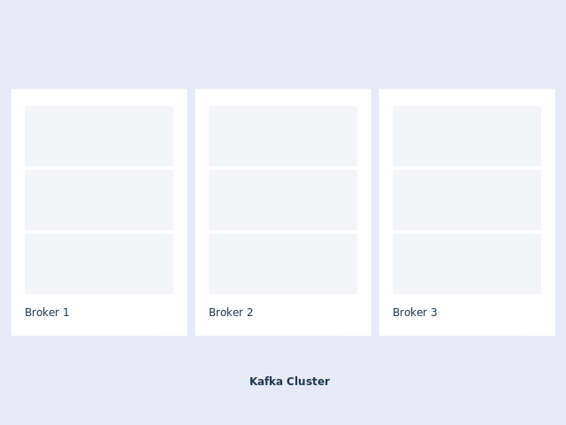
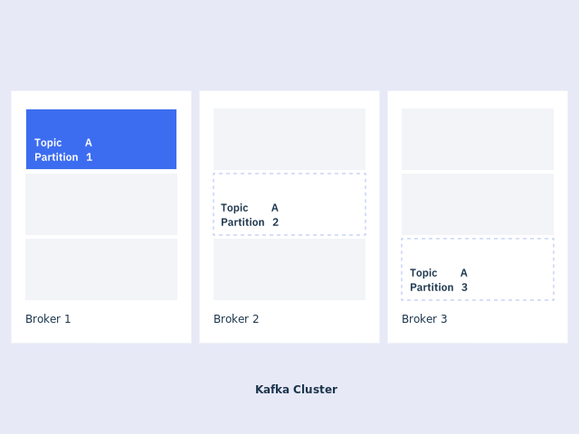
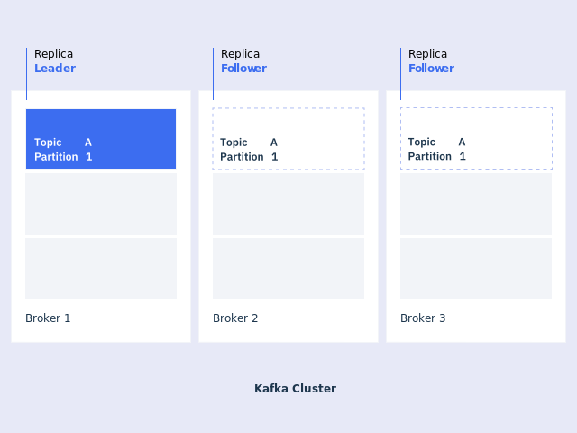
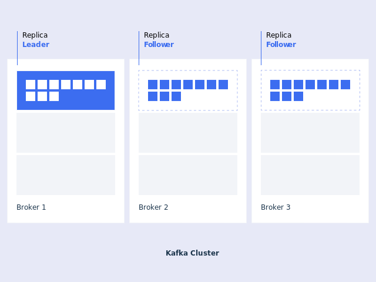
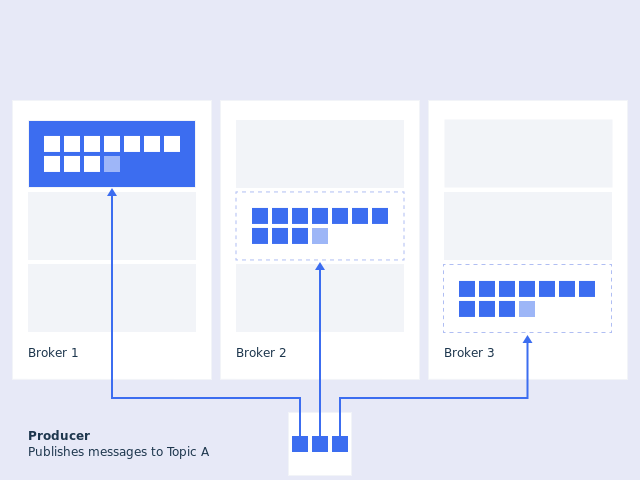
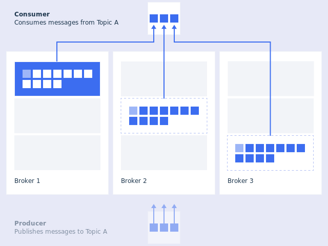

---

copyright:
  years: 2015, 2019
lastupdated: "2020-05-07"

keywords: IBM Event Streams, Kafka as a service, managed Apache Kafka

subcollection: EventStreams

---

{:new_window: target="_blank"}
{:shortdesc: .shortdesc}
{:screen: .screen}
{:codeblock: .codeblock}
{:pre: .pre}

# Apache Kafka concepts
{: #apache_kafka}

The following list defines some Apache Kafka concepts:

## Brokers

Apache Kafka is a distributed messaging system. A Kafka cluster consists of a set of brokers.
A cluster has a minimum of 3 brokers.

## Messages

A message is a unit of data in Kafka. Each message is represented as a record, which comprises two parts: key and value. The key is commonly used for data about the message and the value is the body of the message. Kafka uses the terms record and message interchangeably. 

## Topics and partitions
Each topic is a named stream of messages. A topic is made up of one or more partitions. The messages on a partition are ordered by a number called the offset. By having multiple partitions distributed across the brokers, the scalability of a topic is increased.

If a topic has more than one partition, it allows data to be fed through in parallel to increase throughput by distributing the partitions across the cluster. The number of partitions also influences the balancing of workload among consumers.

For more information, see [Partition leadership](/docs/EventStreams?topic=EventStreams-partition_leadership#partition_leadership).

## Replication

To improve availability, each topic can be replicated onto multiple brokers. For each partition, one of the brokers is the leader, and the other brokers are the followers.

Replication works by the followers repeatedly fetching messages from the leader.

## In-sync replicas

A follower replica that is keeping up with the partition leader is in-sync. Any follower with an in-sync replica can become the leader without losing any messages.

If the partition leader fails, another leader is chosen from the followers. All the replicas should usually be in-sync. It's acceptable for a replica to be temporarily not in-sync while it's catching up after a failure.

## Producers

A producer publishes messages to one or more topics. A producer can publish to one or more topics and can optionally choose the partition that stores the data.

You can also configure your producer to prioritize speed or reliability by choosing the level of acknowledgement the producer receives for messages it publishes.

For more information, see [Producing Messages](/docs/EventStreams?topic=EventStreams-producing_messages#producing_messages).

## Consumers

A consumer reads messages from one or more topics and processes them. The difference between a consumer's current position and the newest message on a partition is known as the offset lag.

If the lag increases over time, it is a sign that the consumer is not able to keep up. Over the short term, this is not an issue but eventually the consumer could miss messages if the retention period is exceeded.

For more information, see [Consuming Messages](/docs/EventStreams?topic=EventStreams-consuming_messages#consuming_messages).

## Consumer Groups

A consumer group contains one or more consumers working together to process the messages. The messages from a single partition are processed by one consumer in each group.

At any time, each partition is assigned to only one consumer in the group. This ensures that the messages on each partition are processed in order.

If there are more partitions than consumers in a group, some consumers have multiple partitions. If there are more consumers than partitions, some consumers have no partitions.

## Additional links

To learn more, see the following information:
- [Apache Kafka documentation ](http://kafka.apache.org/documentation.html){:new_window} 

<!-- 27/06/18 Karen: removing - suggestion from James

## {{site.data.keyword.messagehub}} plans
{{site.data.keyword.messagehub}} is available as two different plans depending on your requirements: Standard and Enterprise.

* Choose the Standard plan if you want event ingest and distribution capabilities, where you pay for what you use and share infrastructure with others.
* Choose the Enterprise plan if data isolation, guaranteed performance, and increased retention are important considerations. 

For more information, see [Choosing your plan](/docs/EventStreams/eventstreams085.html).
-->

