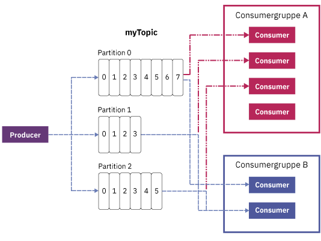

---

copyright:
  years: 2015, 2019
lastupdated: "2019-01-23"

keywords: IBM Event Streams, Kafka as a service, managed Apache Kafka

subcollection: eventstreams

---

{:new_window: target="_blank"}
{:shortdesc: .shortdesc}
{:screen: .screen}
{:codeblock: .codeblock}
{:pre: .pre}

# Apache Kafka-Konzepte
{: #apache_kafka}

{: shortdesc}

Die folgende Liste enthält einige Apache Kafka-Konzepte:

<dl>
<dt>Server</dt>
<dd>Eine Kafka-Installation besteht aus einem oder mehreren einzelnen Servermaschinen. Diese Server können sich in geographisch unterschiedlichen Rechenzentren befinden. 
</dd>
 
<dt>Cluster</dt>
<dd>Kafka wird als Cluster von einem oder mehreren Servern ausgeführt. Die Last wird über den Cluster verteilt, indem sie auf die Server verteilt wird.</dd>
 
<dt>Nachricht</dt>
<dd>Die Dateneinheit in Kafka. Jede Nachricht wird als Datensatz dargestellt, der aus zwei Teilen besteht: Schlüssel und Wert. Der Schlüssel wird in der Regel für Daten zur Nachricht verwendet und der Wert ist der Nachrichtentext. Kafka verwendet die Begriffe "Datensatz" und "Nachricht" synonym. 

Viele andere Nachrichtensysteme können mit den Nachrichten auch andere Informationen übertragen. Kafka 0.11 enthält erstmalig zu diesem Zweck Datensatz-Header, die von {{site.data.keyword.messagehub}} unterstützt werden. 
 

Da viele Tools im Kafka-Ökosystem (wie Connectors zu anderen Systemen) nur den Wert verwenden und den Schlüssel ignorieren, wird empfohlen, alle Nachrichtendaten in den Wert aufzunehmen und nur den Schlüssel für die Partitionierung oder Protokollkomprimierung zu verwenden. Verlassen Sie sich nicht auf alles, was aus Kafka ausgelesen wird, um den Schlüssel zu nutzen.
   </dd>
<dt>Topic</dt>
<dd>Ein benannter Datenstrom von Nachrichten.</dd>
 
<dt>Partition</dt>
<dd>Jedes Topic setzt sich aus einer oder mehreren Partitionen zusammen. Jede Partition ist eine sortierte Liste von Nachrichten. Die Nachrichten auf einer Partition erhalten jeweils eine monoton ansteigende Zahl, die Offset heißt. 

Jede Partition verfügt über einen Server im Cluster, der als Leader der Partition fungiert, und über andere Server, die als Follower fungieren.

Wenn ein Topic mehr als eine Partition aufweist, können Daten parallel gespeist werden, um den Durchsatz zu erhöhen, indem die Partitionen im Cluster verteilt werden. Die Anzahl der Partitionen beeinflusst auch den Lastausgleich zwischen den Consumern.

Weitere Informationen finden Sie in [Partitions-Leadership](/docs/services/EventStreams?topic=eventstreams-partition_leadership).</dd>
<dt>Producer</dt>
<dd>Ein Prozess, der Datenströme von Nachrichten in Kafka-Topics veröffentlicht. Ein Producer kann Datenströme in einem oder mehreren Topics veröffentlichen und optional die Partition auswählen, in denen die Daten gespeichert werden. </dd>
 
<dt>Consumer </dt>
<dd>Ein Prozess, der Nachrichten aus Kafka-Topics und den Feed von Nachrichten verarbeitet. Ein Consumer kann mindestens ein Topic oder eine Partition verarbeiten.</dd>
 
<dt>Consumergruppe</dt>
<dd>Eine benannte Gruppe aus einem oder mehreren Consumern, die zusammen die Nachrichten aus einem Topic-Satz verarbeiten. Jeder Consumer in der Gruppe liest Nachrichten aus bestimmten Partitionen, die dem Consumer zugeordnet ist. Jede Partition ist nur einem Consumer in der Gruppe zugeordnet.
<ul>
<li>Wenn es mehr Partitionen als Consumer in einer Gruppe gibt, haben einige Consumer mehrere Partitionen.</li>
<li>Wenn es mehr Consumer als Partitionen gibt, haben einige Consumer keine Partitionen.</li>
</ul>
</dd>
</dl>

Weitere Informationen finden Sie hier:
- [Nachrichten erstellen](/docs/services/EventStreams?topic=eventstreams-producing_messages)
- [Nachrichten verarbeiten](/docs/services/EventStreams?topic=eventstreams-consuming_messages) 
- [Partitions-Leadership](/docs/services/EventStreams?topic=eventstreams-partition_leadership) 
- [Apache Kafka-Dokumentation ](http://kafka.apache.org/documentation.html){:new_window} 

<!-- 27/06/18 Karen: removing - suggestion from James

## {{site.data.keyword.messagehub}} plans
{{site.data.keyword.messagehub}} is available as two different plans depending on your requirements: Standard and Enterprise.

* Choose the Standard plan if you want event ingest and distribution capabilities, where you pay for what you use and share infrastructure with others.
* Choose the Enterprise plan if data isolation, guaranteed performance, and increased retention are important considerations. 

For more information, see [Choosing your plan](/docs/services/EventStreams/eventstreams085.html).
-->

