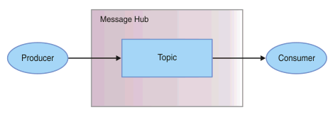

---

copyright:
  years: 2015, 2018
lastupdated: "2018-11-15"

---

{:new_window: target="_blank"}
{:shortdesc: .shortdesc}
{:screen: .screen}
{:codeblock: .codeblock}
{:pre: .pre}

# Einführung in {{site.data.keyword.messagehub}} 
{: #getting_started}

Als Einführung in die Verwendung von {{site.data.keyword.messagehub}} zum
Senden und Empfangen von Nachrichten können Sie das bereitgestellte Java™-Beispiel verwenden. Das
Beispiel verdeutlicht, wie Nachrichten unter Verwendung eines Topics von einem Producer an einen
Consumer gesendet werden. Das gleiche Beispielprogramm wird verwendet, um Nachrichten zu verarbeiten und
Nachrichten zu erstellen.

Weitere Informationen zur Funktionsweise von {{site.data.keyword.messagehub}} finden Sie in [Informationen zu {{site.data.keyword.messagehub}}](/docs/services/EventStreams/eventstreams010.html). {{site.data.keyword.messagehub}} wurde früher als Message Hub bezeichnet.

Um auf andere {{site.data.keyword.messagehub}}-Beispiele zuzugreifen, beispielsweise auf "Node.js" und "Python" siehe die [{{site.data.keyword.messagehub}}-Beispiele ](https://github.com/ibm-messaging/event-streams-samples){:new_window}.

<!-- 11/01/18 - Karen - removing diagram as requested by James

-->

Führen Sie die folgenden Schritte aus:
{: #getting_started_steps}
 
1. Erstellen Sie eine {{site.data.keyword.messagehub}}-Serviceinstanz:

  a. Melden Sie sich bei der {{site.data.keyword.Bluemix_notm}}-Konsole an. 
  
  b. Klicken Sie auf **Katalog**.
  
  c. Wählen Sie im Abschnitt **Integration** den **{{site.data.keyword.messagehub}}-Plan "Standard"** aus. Die Seite für die {{site.data.keyword.messagehub}}-Serviceinstanz wird geöffnet.
  
  d. Geben Sie einen Namen für den Service ein. Sie können den Standardwert verwenden.
  
  e. Klicken Sie auf **Erstellen**.

2. {: #create_credentials_step notoc} Erstellen Sie {{site.data.keyword.messagehub}}-Berechtigungsnachweise, indem Sie diese Schritte ausführen: [Berechtigungsnachweise abrufen und Verbindung über die IBM Cloud-Konsole herstellen](/docs/services/EventStreams/eventstreams127.html#connect_standard_cf_console).
   <br/>
   <br/>Sie benötigen die Werte für *kafka_brokers_sasl*, *kafka_admin_url* und *api_key* für [Schritt 7](/docs/services/EventStreams/index.html#start_consumer_step) dieser Task.   

3. Installieren Sie die folgenden vorausgesetzten Komponenten (falls noch nicht vorhanden):

    * [git ](https://git-scm.com/){:new_window}
	* [Gradle ](https://gradle.org/){:new_window}
    * Java 8 oder höher
 
4. Klonen Sie das Git-Repository 'event-streams-samples', indem Sie den folgenden Befehl über die Befehlszeile ausführen:

    <pre class="pre">
    git clone https://github.com/ibm-messaging/event-streams-samples.git
    </pre>
	{: codeblock}

5. Wechseln Sie in das Verzeichnis mit dem Beispiel für die Java-Konsole, indem Sie den folgenden Befehl ausführen:

    <pre class="pre">
    cd event-streams-samples/kafka-java-console-sample
    </pre>
	{: codeblock}

6. Führen Sie die folgenden Erstellungsbefehle aus:

    <pre class="pre">
    gradle clean && gradle build
    </pre>
	{: codeblock}

7. {: #start_consumer_step notoc} Starten Sie den Consumer in Ihrer Konsole, indem Sie den folgenden Befehl ausführen:

    <pre class="pre">java -jar build/libs/kafka-java-console-sample-2.0-all.jar
	<var class="keyword varname">kafka_brokers_sasl</var> <var class="keyword varname">kafka_admin_url</var> token<var class="keyword varname">:api_key</var> -consumer</pre>
    {: codeblock}
    
    In dem Beispiel wird ein Topic mit dem Namen `kafka-java-console-sample-topic` verwendet. Wenn das Topic noch nicht
    vorhanden ist, wird es in dem Beispiel mithilfe der {{site.data.keyword.messagehub}}-Verwaltungs-API erstellt. Zum Senden und Empfangen
    von Nachrichten wird in dem Beispiel die Apache Kafka-Java-API verwendet.

    Verwenden Sie die Werte für *kafka_brokers_sasl*, *kafka_admin_url* und
    *api_key* aus den Berechtigungsnachweisen, die Sie in [Schritt 2](/docs/services/EventStreams/index.html#create_credentials_step) erstellt haben.
	
	Geben Sie <code>token</code> als Ihren Benutzernamen an und den <var class="keyword varname">api_key</var> als Kennwort. Trennen Sie <code>token</code> und den <var class="keyword varname">api_key</var> durch einen Doppelpunkt voneinander.
    
	**Wichtig:** *kafka_brokers_sasl* muss eine einzige Zeichenfolge sein, die in Anführungszeichen angegeben ist. Beispiel:

    <pre class="pre">
    "host1:port1,host2:port2"
    </pre>
	{: codeblock}

    Es wird empfohlen, alle Kafka-Hosts zu verwenden, die in den von Ihnen ausgewählten **Berechtigungsnachweisen** aufgelistet sind.

8. Starten Sie den Producer in Ihrer Konsole, indem Sie den folgenden Befehl ausführen:
   
    <pre class="pre">java -jar build/libs/kafka-java-console-sample-2.0-all.jar
	<var class="keyword varname">kafka_brokers_sasl</var> <var class="keyword varname">kafka_admin_url</var> token<var class="keyword varname">:api_key</var> -producer</pre>
 {: codeblock}
  
9. Nun müssten die vom Producer gesendeten Nachrichten im Consumer angezeigt werden. Im Folgenden ist eine
Beispielausgabe aufgelistet:

    ```
    [2018-07-02 14:54:50,788] INFO Running in local mode. (com.messagehub.samples.MessageHubConsoleSample)
    [2018-07-02 14:54:50,789] INFO Kafka Endpoints: kafka-0.mh-zarjkgtnzzspbkfrkqgdhmq.us-south.containers.appdomain.cloud:9093,kafka-1.mh-zarjkgtnzzspbkfrkqgdhmq.us-south.containers.appdomain.cloud:9093,kafka-2.mh-zarjkgtnzzspbkfrkqgdhmq.us-south.containers.appdomain.cloud:9093 (com.messagehub.samples.MessageHubConsoleSample)
    [2018-07-02 14:54:50,789] INFO Admin REST Endpoint: https://mh-zarjkgtnzzspbkfrkqgdhmq.us-south.containers.appdomain.cloud (com.messagehub.samples.MessageHubConsoleSample)
    [2018-07-02 14:54:50,789] INFO Creating the topic kafka-java-console-sample-topic (com.messagehub.samples.MessageHubConsoleSample)
    [2018-07-02 14:54:52,680] INFO Admin REST response : (com.messagehub.samples.MessageHubConsoleSample)
    [2018-07-02 14:54:53,351] INFO Admin REST Listing Topics: [{"name":"kafka-java-console-sample-topic","partitions":1,"retentionMs":86400000,"cleanupPolicy":"delete"},{"name":"__consumer_offsets","partitions":50,"retentionMs":86400000,"cleanupPolicy":"compact"}] (com.messagehub.samples.MessageHubConsoleSample)
    [2018-07-02 14:54:55,126] INFO [Partition(topic = kafka-java-console-sample-topic, partition = 0, leader = 0, replicas = [0,2,1], isr = [0,2,1], offlineReplicas = [])] (com.messagehub.samples.ConsumerRunnable)
    [2018-07-02 14:54:55,126] INFO class com.messagehub.samples.ConsumerRunnable is starting. (com.messagehub.samples.ConsumerRunnable)
    [2018-07-02 14:54:56,328] INFO [Partition(topic = kafka-java-console-sample-topic, partition = 0, leader = 0, replicas = [0,2,1], isr = [0,2,1], offlineReplicas = [])] (com.messagehub.samples.ProducerRunnable)
    [2018-07-02 14:54:56,328] INFO MessageHubConsoleSample will run until interrupted. (com.messagehub.samples.MessageHubConsoleSample)
    [2018-07-02 14:54:56,328] INFO class com.messagehub.samples.ProducerRunnable is starting. (com.messagehub.samples.ProducerRunnable)
    [2018-07-02 14:54:57,514] INFO Message produced, offset: 0 (com.messagehub.samples.ProducerRunnable)
    [2018-07-02 14:54:59,652] INFO Message produced, offset: 1 (com.messagehub.samples.ProducerRunnable)
    [2018-07-02 14:55:00,671] INFO No messages consumed (com.messagehub.samples.ConsumerRunnable)
    [2018-07-02 14:55:01,788] INFO Message produced, offset: 2 (com.messagehub.samples.ProducerRunnable)
    [2018-07-02 14:55:01,797] INFO Message consumed: ConsumerRecord(topic = kafka-java-console-sample-topic, partition = 0, offset = 2, CreateTime = 1530539701655, serialized key size = 3, serialized value size = 25, headers = RecordHeaders(headers = [], isReadOnly = false), key = key, value = This is a test message #2) (com.messagehub.samples.ConsumerRunnable)
    [2018-07-02 14:55:03,921] INFO Message consumed: ConsumerRecord(topic = kafka-java-console-sample-topic, partition = 0, offset = 3, CreateTime = 1530539703789, serialized key size = 3, serialized value size = 25, headers = RecordHeaders(headers = [], isReadOnly = false), key = key, value = This is a test message #3) (com.messagehub.samples.ConsumerRunnable)
    [2018-07-02 14:55:03,921] INFO Message produced, offset: 3 (com.messagehub.samples.ProducerRunnable)
    [2018-07-02 14:55:06,053] INFO Message consumed: ConsumerRecord(topic = kafka-java-console-sample-topic, partition = 0, offset = 4, CreateTime = 1530539705922, serialized key size = 3, serialized value size = 25, headers = RecordHeaders(headers = [], isReadOnly = false), key = key, value = This is a test message #4) (com.messagehub.samples.ConsumerRunnable)
    [2018-07-02 14:55:06,054] INFO Message produced, offset: 4 (com.messagehub.samples.ProducerRunnable)
    [2018-07-02 14:55:08,186] INFO Message consumed: ConsumerRecord(topic = kafka-java-console-sample-topic, partition = 0, offset = 5, CreateTime = 1530539708055, serialized key size = 3, serialized value size = 25, headers = RecordHeaders(headers = [], isReadOnly = false), key = key, value = This is a test message #5) (com.messagehub.samples.ConsumerRunnable)
    ```
	{: codeblock}
	
10. Der Beispielprozess wird fortgesetzt, bis Sie ihn stoppen. Um den Prozess zu stoppen, führen Sie einen
Befehl wie den folgenden aus: <code>Strg+C</code>

<!-- 07/06/18 - Karen: removing until a newer version available
To watch a video that walks
you through getting a Java sample to run against {{site.data.keyword.messagehub}}, see [{{site.data.keyword.messagehub}} - Getting started with IBM's Kafka in the cloud ](https://www.youtube.com/watch?v=tt-bLtFzC_4){:new_window}.
-->


