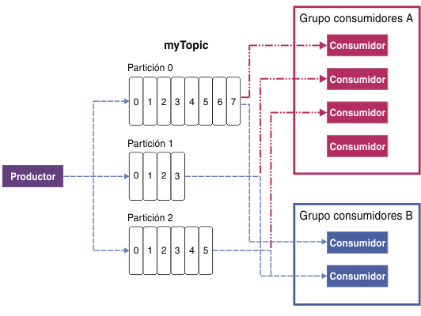

---

copyright:
  years: 2015, 2019
lastupdated: "2019-01-23"

keywords: IBM Event Streams, Kafka as a service, managed Apache Kafka

subcollection: eventstreams

---

{:new_window: target="_blank"}
{:shortdesc: .shortdesc}
{:screen: .screen}
{:codeblock: .codeblock}
{:pre: .pre}

# Conceptos sobre Apache Kafka
{: #apache_kafka}

{: shortdesc}

La siguiente lista define algunos conceptos de Apache Kafka:

<dl>
<dt>Servidor</dt>
<dd>Una instalación de Kafka está formado por una o varias máquinas de servidor individuales. Estos servidores pueden estar en centros de datos geográficamente dispares. 
</dd>
 
<dt>Clúster</dt>
<dd>Kafka se ejecuta como un clúster de uno o varios servidores. La carga está equilibrada en el clúster al distribuirse entre los servidores.</dd>
 
<dt>Mensaje</dt>
<dd>La unidad de datos en Kafka. Cada mensaje está representado en forma de registro, que consta de dos partes: clave y valor. La clave se utiliza habitualmente para los datos sobre el mensaje y el valor es el cuerpo del mensaje. Kafka utiliza los términos registro y mensaje de forma intercambiable. 

Muchos otros sistemas de mensajería también tienen una manera de llevar otra información junto con los mensajes. Kafka 0.11 introduce las cabeceras de registro con este propósito, lo que está soportado por {{site.data.keyword.messagehub}}.  
 

Puesto que muchas herramientas del ecosistema de Kafka (como los conectores para otros sistemas) utilizan sólo el valor e ignoran la clave, es mejor poner todos los datos del mensaje en el valor y sólo utilizar la clave para el particionamiento o la compactación de registros. No debería confiar en todo lo que se lee de Kafka para hacer uso de la clave.
   </dd>
<dt>Tema</dt>
<dd>Una secuencia denominada de mensajes.</dd>
 
<dt>Partición</dt>
<dd>Cada tema contiene una o más particiones. Cada partición es una lista ordenada de mensajes. Se da a cada uno de los mensajes de una partición un número creciente monotónicamente denominado desplazamiento. 

Cada partición tiene un servidor en el clúster que actúa como líder de la partición y otros servidores que actúan como seguidores.

Si un tema tiene más de una partición, permite a los datos alimentarse en paralelo para aumentar el rendimiento distribuyendo las particiones en el clúster. El número de particiones también influye en el equilibrio de carga de trabajo entre los consumidores.

Para obtener más información, consulte [Liderazgo de particiones](/docs/services/EventStreams?topic=eventstreams-partition_leadership).</dd>
<dt>Productor</dt>
<dd>Un proceso que publica secuencias de mensajes en temas Kafka. Un productor puede publicar en uno o más temas y puede elegir opcionalmente la partición que almacena los datos. </dd>
 
<dt>Consumidor </dt>
<dd>Un proceso que consume mensajes de temas Kafka y procesa el canal de información de mensajes. Un consumidor puede consumir uno o varios temas o particiones.</dd>
 
<dt>Grupo de consumidores</dt>
<dd>Un grupo denominado de uno o varios consumidores que de forma conjunta consumen los mensajes de un conjunto de temas. Cada consumidor del grupo lee mensajes de particiones específicas a las que está asignado. Cada partición se asigna a un solo consumidor del grupo.
<ul>
<li>Si hay más particiones que consumidores en un grupo, algunos consumidores tienen varias particiones.</li>
<li>Si hay más consumidores que particiones, algunos consumidores no tienen particiones.</li>
</ul>
</dd>
</dl>

Para saber más, consulte la siguiente información:
- [Generación de mensajes](/docs/services/EventStreams?topic=eventstreams-producing_messages)
- [Consumo de mensajes](/docs/services/EventStreams?topic=eventstreams-consuming_messages) 
- [Liderazgo de particiones](/docs/services/EventStreams?topic=eventstreams-partition_leadership) 
- [Documentación de Apache Kafka ](http://kafka.apache.org/documentation.html){:new_window} 

<!-- 27/06/18 Karen: removing - suggestion from James

## {{site.data.keyword.messagehub}} plans
{{site.data.keyword.messagehub}} is available as two different plans depending on your requirements: Standard and Enterprise.

* Choose the Standard plan if you want event ingest and distribution capabilities, where you pay for what you use and share infrastructure with others.
* Choose the Enterprise plan if data isolation, guaranteed performance, and increased retention are important considerations. 

For more information, see [Choosing your plan](/docs/services/EventStreams/eventstreams085.html).
-->

