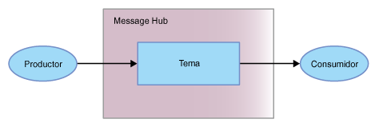

---

copyright:
  years: 2015, 2018
lastupdated: "2018-11-15"

---

{:new_window: target="_blank"}
{:shortdesc: .shortdesc}
{:screen: .screen}
{:codeblock: .codeblock}
{:pre: .pre}

# Iniciación a {{site.data.keyword.messagehub}} 
{: #getting_started}

Para empezar a trabajar con {{site.data.keyword.messagehub}} y empezar a enviar y recibir mensajes, puede utilizar el ejemplo Java™. El ejemplo muestra cómo un productor envía mensajes a un consumidor mediante un tema. Se utiliza el mismo programa de ejemplo para consumir mensajes y producir mensajes.

Para obtener más información sobre el funcionamiento de {{site.data.keyword.messagehub}}, consulte [Acerca de {{site.data.keyword.messagehub}}](/docs/services/EventStreams/eventstreams010.html). {{site.data.keyword.messagehub}} se llamaba anteriormente Message Hub.

Para acceder a otros ejemplos de {{site.data.keyword.messagehub}}, incluidos los ejemplos para Node.js y Python, consulte [Ejemplos de {{site.data.keyword.messagehub}} ](https://github.com/ibm-messaging/event-streams-samples){:new_window}.

<!-- 11/01/18 - Karen - removing diagram as requested by James

-->

Siga estos pasos:
{: #getting_started_steps}
 
1. Cree una instancia de servicio de {{site.data.keyword.messagehub}}:

  a. Inicie sesión en la consola de {{site.data.keyword.Bluemix_notm}}. 
  
  b. Pulse **Catálogo**.
  
  c. En la sección **Integración**, seleccione **Plan Estándar de {{site.data.keyword.messagehub}}**. Se abrirá la página de instancia de servicio de {{site.data.keyword.messagehub}}.
  
  d. Escriba un nombre para el servicio. Puede utilizar el valor predeterminado.
  
  e. Pulse **Crear**.

2. {: #create_credentials_step notoc} Cree algunas credenciales de {{site.data.keyword.messagehub}} completando estos pasos: [obtención de credenciales y conexión mediante la consola de IBM Cloud](/docs/services/EventStreams/eventstreams127.html#connect_standard_cf_console).
   <br/>
   <br/>Necesitará los valores de *kafka_brokers_sasl*, *kafka_admin_url* y *api_key* para el [paso 7](/docs/services/EventStreams/index.html#start_consumer_step) de esta tarea.   

3. Si aún no los tiene, instale los requisitos previos siguientes:

    * [git ](https://git-scm.com/){:new_window}
	* [Gradle ](https://gradle.org/){:new_window}
    * Java 8 o superior
 
4. Clone el repositorio git event-streams-samples ejecutando el siguiente mandato desde la línea de mandatos:

    <pre class="pre">
    git clone https://github.com/ibm-messaging/event-streams-samples.git
    </pre>
	{: codeblock}

5. Cambie el directorio a la consola de java ejecutando el siguiente mandato:

    <pre class="pre">
    cd event-streams-samples/kafka-java-console-sample
    </pre>
	{: codeblock}

6. Ejecute los siguientes mandatos de compilación:

    <pre class="pre">
    gradle clean && gradle build
    </pre>
	{: codeblock}

7. {: #start_consumer_step notoc} Inicie el consumidor en la consola ejecutando el siguiente mandato:

    <pre class="pre">java -jar build/libs/kafka-java-console-sample-2.0-all.jar
	<var class="keyword varname">kafka_brokers_sasl</var> <var class="keyword varname">kafka_admin_url</var> token<var class="keyword varname">:api_key</var> -consumer</pre>
    {: codeblock}
    
    El ejemplo utiliza un tema denominado `kafka-java-console-sample-topic`. Si el tema ya no existe, el ejemplo lo crea utilizando la API de administración de {{site.data.keyword.messagehub}}. Para enviar y recibir mensajes, el ejemplo utiliza la API Apache Kafka Java.

    Utilice los valores para *kafka_brokers_sasl*, *kafka_admin_url*
    y *api_key* desde las credenciales que ha creado en el [paso 2](/docs/services/EventStreams/index.html#create_credentials_step).
	
	Especifique <code>token</code> como nombre de usuario y <var class="keyword varname">api_key</var> como contraseña. Separe <code>token</code>
y <var class="keyword varname">api_key</var> con un signo de dos puntos.
    
	**Importante:** *kafka_brokers_sasl* debe ser una serie única y debe escribirse entre comillas. Por ejemplo:

    <pre class="pre">
    "host1:port1,host2:port2"
    </pre>
	{: codeblock}

    Se recomienda utilizar todos los hosts Kafka listados en el campo **Credenciales** que ha seleccionado.

8. Inicie el productor en la consola ejecutando el siguiente mandato:
   
    <pre class="pre">java -jar build/libs/kafka-java-console-sample-2.0-all.jar
	<var class="keyword varname">kafka_brokers_sasl</var> <var class="keyword varname">kafka_admin_url</var> token<var class="keyword varname">:api_key</var> -producer</pre>
 {: codeblock}
  
9. Ahora deberían aparecer en el consumidor los mensajes enviados por el productor. A continuación, se muestra una salida de ejemplo:

    ```
    [2018-07-02 14:54:50,788] INFO Running in local mode. (com.messagehub.samples.MessageHubConsoleSample)
    [2018-07-02 14:54:50,789] INFO Kafka Endpoints: kafka-0.mh-zarjkgtnzzspbkfrkqgdhmq.us-south.containers.appdomain.cloud:9093,kafka-1.mh-zarjkgtnzzspbkfrkqgdhmq.us-south.containers.appdomain.cloud:9093,kafka-2.mh-zarjkgtnzzspbkfrkqgdhmq.us-south.containers.appdomain.cloud:9093 (com.messagehub.samples.MessageHubConsoleSample)
    [2018-07-02 14:54:50,789] INFO Admin REST Endpoint: https://mh-zarjkgtnzzspbkfrkqgdhmq.us-south.containers.appdomain.cloud (com.messagehub.samples.MessageHubConsoleSample)
    [2018-07-02 14:54:50,789] INFO Creating the topic kafka-java-console-sample-topic (com.messagehub.samples.MessageHubConsoleSample)
    [2018-07-02 14:54:52,680] INFO Admin REST response : (com.messagehub.samples.MessageHubConsoleSample)
    [2018-07-02 14:54:53,351] INFO Admin REST Listing Topics: [{"name":"kafka-java-console-sample-topic","partitions":1,"retentionMs":86400000,"cleanupPolicy":"delete"},{"name":"__consumer_offsets","partitions":50,"retentionMs":86400000,"cleanupPolicy":"compact"}] (com.messagehub.samples.MessageHubConsoleSample)
    [2018-07-02 14:54:55,126] INFO [Partition(topic = kafka-java-console-sample-topic, partition = 0, leader = 0, replicas = [0,2,1], isr = [0,2,1], offlineReplicas = [])] (com.messagehub.samples.ConsumerRunnable)
    [2018-07-02 14:54:55,126] INFO class com.messagehub.samples.ConsumerRunnable is starting. (com.messagehub.samples.ConsumerRunnable)
    [2018-07-02 14:54:56,328] INFO [Partition(topic = kafka-java-console-sample-topic, partition = 0, leader = 0, replicas = [0,2,1], isr = [0,2,1], offlineReplicas = [])] (com.messagehub.samples.ProducerRunnable)
    [2018-07-02 14:54:56,328] INFO MessageHubConsoleSample will run until interrupted. (com.messagehub.samples.MessageHubConsoleSample)
    [2018-07-02 14:54:56,328] INFO class com.messagehub.samples.ProducerRunnable is starting. (com.messagehub.samples.ProducerRunnable)
    [2018-07-02 14:54:57,514] INFO Message produced, offset: 0 (com.messagehub.samples.ProducerRunnable)
    [2018-07-02 14:54:59,652] INFO Message produced, offset: 1 (com.messagehub.samples.ProducerRunnable)
    [2018-07-02 14:55:00,671] INFO No messages consumed (com.messagehub.samples.ConsumerRunnable)
    [2018-07-02 14:55:01,788] INFO Message produced, offset: 2 (com.messagehub.samples.ProducerRunnable)
    [2018-07-02 14:55:01,797] INFO Message consumed: ConsumerRecord(topic = kafka-java-console-sample-topic, partition = 0, offset = 2, CreateTime = 1530539701655, serialized key size = 3, serialized value size = 25, headers = RecordHeaders(headers = [], isReadOnly = false), key = key, value = This is a test message #2) (com.messagehub.samples.ConsumerRunnable)
    [2018-07-02 14:55:03,921] INFO Message consumed: ConsumerRecord(topic = kafka-java-console-sample-topic, partition = 0, offset = 3, CreateTime = 1530539703789, serialized key size = 3, serialized value size = 25, headers = RecordHeaders(headers = [], isReadOnly = false), key = key, value = This is a test message #3) (com.messagehub.samples.ConsumerRunnable)
    [2018-07-02 14:55:03,921] INFO Message produced, offset: 3 (com.messagehub.samples.ProducerRunnable)
    [2018-07-02 14:55:06,053] INFO Message consumed: ConsumerRecord(topic = kafka-java-console-sample-topic, partition = 0, offset = 4, CreateTime = 1530539705922, serialized key size = 3, serialized value size = 25, headers = RecordHeaders(headers = [], isReadOnly = false), key = key, value = This is a test message #4) (com.messagehub.samples.ConsumerRunnable)
    [2018-07-02 14:55:06,054] INFO Message produced, offset: 4 (com.messagehub.samples.ProducerRunnable)
    [2018-07-02 14:55:08,186] INFO Message consumed: ConsumerRecord(topic = kafka-java-console-sample-topic, partition = 0, offset = 5, CreateTime = 1530539708055, serialized key size = 3, serialized value size = 25, headers = RecordHeaders(headers = [], isReadOnly = false), key = key, value = This is a test message #5) (com.messagehub.samples.ConsumerRunnable)
    ```
	{: codeblock}
	
10. El ejemplo se ejecuta indefinidamente hasta que lo detenga. Para detener el proceso, ejecute un mandato como el siguiente: <code>Control+C</code>

<!-- 07/06/18 - Karen: removing until a newer version available
To watch a video that walks
you through getting a Java sample to run against {{site.data.keyword.messagehub}}, see [{{site.data.keyword.messagehub}} - Getting started with IBM's Kafka in the cloud ](https://www.youtube.com/watch?v=tt-bLtFzC_4){:new_window}.
-->


