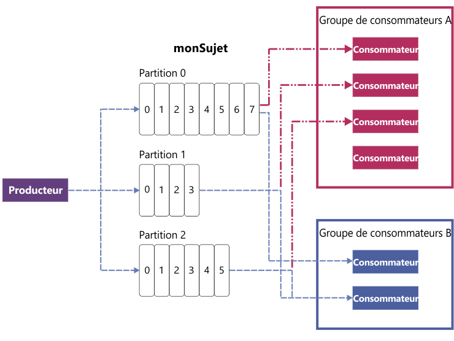

---

copyright:
  years: 2015, 2018
lastupdated: "2018-06-29"

---

{:new_window: target="_blank"}
{:shortdesc: .shortdesc}
{:screen: .screen}
{:codeblock: .codeblock}
{:pre: .pre}

# Concepts Apache Kafka
{: #apache_kafka}

La liste suivante présente certains concepts d'Apache Kafka :

<dl>
<dt>Serveur</dt>
<dd>Une installation Kafka est constituée d'une ou plusieurs machines de serveur individuelles. Ces serveurs peuvent se trouver dans des centres de données géographiquement différents. 
</dd>
 
<dt>Cluster</dt>
<dd>Kafka fonctionne comme un cluster d'un ou plusieurs serveurs. La charge est équilibrée dans le cluster en la répartissant entre les serveurs.</dd>
 
<dt>Message</dt>
<dd>Unité de données dans Kafka. Chaque message est représenté sous forme d'enregistrement composé de deux parties : une clé et une valeur. La clé est généralement utilisée pour les données concernant le message et la valeur constitue le corps du message. Kafka utilise indifféremment les termes enregistrement et message. 

Bon nombre d'autres systèmes de messagerie disposent également d'un moyen de transmettre d'autres informations avec les messages. Kafka 0.11 introduit à cet effet les en-têtes d'enregistrement, qui sont pris en charge par le plan Enterprise de {{site.data.keyword.messagehub}}. Etant donné que le plan Standard de {{site.data.keyword.messagehub}} est actuellement basé sur Kafka 0.10.2.1, il ne prend pas encore en charge les en-têtes. 
 

Etant donné que de nombreux outils de l'écosystème Kafka (tels les connecteurs à d'autres systèmes) utilisent uniquement la valeur et ignorent la clé, il est préférable de placer toutes les données du message dans la valeur et de n'utiliser la clé que pour le partitionnement ou la compression de journal. Ne vous fiez pas à tout ce que vous pouvez lire sur Kafka pour utiliser la clé.
   </dd>
<dt>Sujet</dt>
<dd>Flux nommé de messages.</dd>
 
<dt>Partition</dt>
<dd>Chaque sujet comporte une ou plusieurs partitions. Chaque partition est une liste ordonnée de messages. Un numéro, appelé position, qui s'accroît de manière monotone, est attribué à chaque message d'une partition. 

Chaque partition dispose dans le cluster d'un serveur qui fait office de responsable (leader) de la partition, les autres serveurs faisant office de suiveurs.

Si un sujet dispose de plusieurs partions, les données peuvent y être envoyées en parallèle afin d'augmenter la capacité de traitement en répartissant les partitions dans le cluster. Le nombre de partitions joue également sur l'équilibrage de la charge de travail entre les consommateurs.

Pour plus d'informations, voir [Leadership de partition](/docs/services/EventStreams/eventstreams118.html).</dd>
<dt>Producteur</dt>
<dd>Processus qui publie les flux de messages dans les sujets Kafka. Un producteur peut publier dans un ou plusieurs sujets et choisir éventuellement la partition qui stocke les données. </dd>
 
<dt>Consommateur </dt>
<dd>Processus qui consomme les messages des sujets Kafka et traite le flux des messages. Un consommateur peut consommer à partir d'un ou plusieurs sujets ou partitions.</dd>
 
<dt>Groupe de consommateurs</dt>
<dd>Groupe nommé d'un ou plusieurs consommateurs qui consomment conjointement les messages d'un ensemble de sujets. Chaque consommateur du groupe lit les messages des partitions qui lui ont été affectées. Chaque partition est affectée uniquement à un seul consommateur du groupe.
<ul>
<li>S'il existe plus de partitions que de consommateurs dans un groupe, certains consommateurs ont plusieurs partitions.</li>
<li>S'il y a plus de consommateurs que de partitions, certains consommateurs n'ont pas de partitions.</li>
</ul>
</dd>
</dl>

Pour en savoir plus, voir les informations suivantes :
- [Génération de messages](/docs/services/EventStreams/eventstreams112.html)
- [Messages relatifs à la consommation](/docs/services/EventStreams/eventstreams114.html) 
- [Leadership de partition](/docs/services/EventStreams/eventstreams118.html) 
- [Documentation Apache Kafka ](http://kafka.apache.org/documentation.html){:new_window} 

<!-- 27/06/18 Karen: removing - suggestion from James

## {{site.data.keyword.messagehub}} plans
{{site.data.keyword.messagehub}} is available as two different plans depending on your requirements: Standard and Enterprise.

* Choose the Standard plan if you want event ingest and distribution capabilities, where you pay for what you use and share infrastructure with others.
* Choose the Enterprise plan if data isolation, guaranteed performance, and increased retention are important considerations. 

For more information, see [Choosing your plan](/docs/services/EventStreams/eventstreams085.html).
-->

