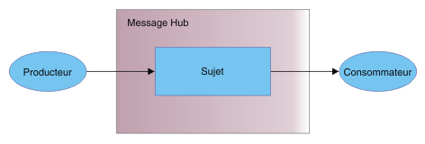

---

copyright:
  years: 2015, 2018
lastupdated: "2018-07-13"

---

{:new_window: target="_blank"}
{:shortdesc: .shortdesc}
{:screen: .screen}
{:codeblock: .codeblock}
{:pre: .pre}

# Initiation à Message Hub 
{: #messagehub}

Pour vous familiariser avec {{site.data.keyword.messagehub}}
et commencer à envoyer et à recevoir des messages, utilisez l'exemple Java™. Cet exemple montre comment
un producteur envoie des messages à un consommateur à l'aide d'un sujet. Le même
exemple de programme permet de consommer et de produire des messages.

Pour mieux comprendre comment fonctionne {{site.data.keyword.messagehub}}, voir [A propos de {{site.data.keyword.messagehub}}](/docs/services/MessageHub/messagehub010.html).

Pour accéder à d'autres exemples {{site.data.keyword.messagehub}}, y compris des exemples pour Node.js et Python, voir [Exemples {{site.data.keyword.messagehub}} ](https://github.com/ibm-messaging/message-hub-samples){:new_window}.

<!-- 11/01/18 - Karen - removing diagram as requested by James

-->

Procédez comme suit :
{: #getting_started_steps}
 
1. Créez une instance de service {{site.data.keyword.messagehub}} :

  a. Connectez-vous à {{site.data.keyword.Bluemix_notm}} à l'aide de l'interface utilisateur Web. 
  
  b. Cliquez sur **CATALOGUE**.
  
  c. Dans la section **Services d'application**, sélectionnez **Plan Standard {{site.data.keyword.messagehub}}**. La page de l'instance de service {{site.data.keyword.messagehub}} s'ouvre.
  
  d. Laissez le service déconnecté dans le menu **Connecter à** et entrez le nom de votre service, ainsi que les données d'identification. Vous pouvez utiliser les valeurs par défaut.
  
  e. Cliquez sur **Créer**.

2. Si vous n'en disposez pas déjà, installez la configuration requise suivante :

    * [git ](https://git-scm.com/){:new_window}
	* [Gradle ](https://gradle.org/){:new_window}
    * Java 8 ou version ultérieure
 
3. Clonez le référentiel Git message-hub-samples en exécutant la commande suivante à partir de la ligne de commande :

    <pre class="pre">
    git clone https://github.com/ibm-messaging/message-hub-samples.git
    </pre>
	{: codeblock}

4. Accédez au répertoire de l'exemple de console Java en exécutant la commande suivante :

    <pre class="pre">
    cd message-hub-samples/kafka-java-console-sample
    </pre>
	{: codeblock}

5. Exécutez les commandes de génération suivantes :

    <pre class="pre">
    gradle clean && gradle build
    </pre>
	{: codeblock}

6. Démarrez le consommateur sur votre console en exécutant la commande suivante :

    <pre class="pre">java -jar build/libs/kafka-java-console-sample-2.0.jar 
	<var class="keyword varname">kafka_brokers_sasl</var> <var class="keyword varname">url_admin_kafka</var> token<var class="keyword varname">:api_key</var> -consumer</pre>
    {: codeblock}
    
    Cet exemple utilise un sujet nommé `kafka-java-console-sample-topic`. Si le sujet n'existe pas déjà, l'exemple le crée à l'aide de l'API d'administration {{site.data.keyword.messagehub}}. Pour envoyer et recevoir des messages, l'exemple utilise l'API Java Apache Kafka.

    Pour trouver les valeurs de *kafka_brokers_sasl*, *kafka_admin_url* et *api_key*, accédez à votre instance {{site.data.keyword.messagehub}} dans {{site.data.keyword.Bluemix_notm}}, cliquez sur l'onglet **Données d'identification pour le service** et sélectionnez les **Données d'identification** que vous souhaitez utiliser.
	
	Indiquez <code>token</code> comme nom d'utilisateur et <var class="keyword varname">api_key</var> comme mot de passe. Séparez <code>token</code> et <var class="keyword varname">api_key</var> par une virgule.
    
	**Important :** *kafka_brokers_sasl* doit être une chaîne unique, encadrée de guillemets. Par exemple :

    <pre class="pre">
    "host1:port1,host2:port2"
    </pre>
	{: codeblock}

    Il est conseillé d'utiliser tous les hôtes Kafka répertoriés dans les **Données d'identification** que vous avez sélectionnées.

7. Démarrez le producteur sur votre console en exécutant la commande suivante :
   
    <pre class="pre">java -jar build/libs/kafka-java-console-sample-2.0.jar 
	<var class="keyword varname">kafka_brokers_sasl</var> <var class="keyword varname">kafka_admin_url</var> token<var class="keyword varname">:api_key</var> -producer</pre>
 {: codeblock}
  
8. Vous devriez voir les messages envoyés par le producteur apparaître sur dans le consommateur. Voici
un exemple de sortie :

    ```
    [2018-07-02 14:54:50,788] INFO Running in local mode. (com.messagehub.samples.MessageHubConsoleSample)
    [2018-07-02 14:54:50,789] INFO Kafka Endpoints: kafka-0.mh-zarjkgtnzzspbkfrkqgdhmq.us-south.containers.appdomain.cloud:9093,kafka-1.mh-zarjkgtnzzspbkfrkqgdhmq.us-south.containers.appdomain.cloud:9093,kafka-2.mh-zarjkgtnzzspbkfrkqgdhmq.us-south.containers.appdomain.cloud:9093 (com.messagehub.samples.MessageHubConsoleSample)
    [2018-07-02 14:54:50,789] INFO Admin REST Endpoint: https://mh-zarjkgtnzzspbkfrkqgdhmq.us-south.containers.appdomain.cloud (com.messagehub.samples.MessageHubConsoleSample)
    [2018-07-02 14:54:50,789] INFO Creating the topic kafka-java-console-sample-topic (com.messagehub.samples.MessageHubConsoleSample)
    [2018-07-02 14:54:52,680] INFO Admin REST response : (com.messagehub.samples.MessageHubConsoleSample)
    [2018-07-02 14:54:53,351] INFO Admin REST Listing Topics: [{"name":"kafka-java-console-sample-topic","partitions":1,"retentionMs":86400000,"cleanupPolicy":"delete"},{"name":"__consumer_offsets","partitions":50,"retentionMs":86400000,"cleanupPolicy":"compact"}] (com.messagehub.samples.MessageHubConsoleSample)
    [2018-07-02 14:54:55,126] INFO [Partition(topic = kafka-java-console-sample-topic, partition = 0, leader = 0, replicas = [0,2,1], isr = [0,2,1], offlineReplicas = [])] (com.messagehub.samples.ConsumerRunnable)
    [2018-07-02 14:54:55,126] INFO class com.messagehub.samples.ConsumerRunnable is starting. (com.messagehub.samples.ConsumerRunnable)
    [2018-07-02 14:54:56,328] INFO [Partition(topic = kafka-java-console-sample-topic, partition = 0, leader = 0, replicas = [0,2,1], isr = [0,2,1], offlineReplicas = [])] (com.messagehub.samples.ProducerRunnable)
    [2018-07-02 14:54:56,328] INFO MessageHubConsoleSample will run until interrupted. (com.messagehub.samples.MessageHubConsoleSample)
    [2018-07-02 14:54:56,328] INFO class com.messagehub.samples.ProducerRunnable is starting. (com.messagehub.samples.ProducerRunnable)
    [2018-07-02 14:54:57,514] INFO Message produced, offset: 0 (com.messagehub.samples.ProducerRunnable)
    [2018-07-02 14:54:59,652] INFO Message produced, offset: 1 (com.messagehub.samples.ProducerRunnable)
    [2018-07-02 14:55:00,671] INFO No messages consumed (com.messagehub.samples.ConsumerRunnable)
    [2018-07-02 14:55:01,788] INFO Message produced, offset: 2 (com.messagehub.samples.ProducerRunnable)
    [2018-07-02 14:55:01,797] INFO Message consumed: ConsumerRecord(topic = kafka-java-console-sample-topic, partition = 0, offset = 2, CreateTime = 1530539701655, serialized key size = 3, serialized value size = 25, headers = RecordHeaders(headers = [], isReadOnly = false), key = key, value = This is a test message #2) (com.messagehub.samples.ConsumerRunnable)
    [2018-07-02 14:55:03,921] INFO Message consumed: ConsumerRecord(topic = kafka-java-console-sample-topic, partition = 0, offset = 3, CreateTime = 1530539703789, serialized key size = 3, serialized value size = 25, headers = RecordHeaders(headers = [], isReadOnly = false), key = key, value = This is a test message #3) (com.messagehub.samples.ConsumerRunnable)
    [2018-07-02 14:55:03,921] INFO Message produced, offset: 3 (com.messagehub.samples.ProducerRunnable)
    [2018-07-02 14:55:06,053] INFO Message consumed: ConsumerRecord(topic = kafka-java-console-sample-topic, partition = 0, offset = 4, CreateTime = 1530539705922, serialized key size = 3, serialized value size = 25, headers = RecordHeaders(headers = [], isReadOnly = false), key = key, value = This is a test message #4) (com.messagehub.samples.ConsumerRunnable)
    [2018-07-02 14:55:06,054] INFO Message produced, offset: 4 (com.messagehub.samples.ProducerRunnable)
    [2018-07-02 14:55:08,186] INFO Message consumed: ConsumerRecord(topic = kafka-java-console-sample-topic, partition = 0, offset = 5, CreateTime = 1530539708055, serialized key size = 3, serialized value size = 25, headers = RecordHeaders(headers = [], isReadOnly = false), key = key, value = This is a test message #5) (com.messagehub.samples.ConsumerRunnable)
    ```
	{: codeblock}
	
9. L'exemple s'exécute indéfiniment jusqu'à ce que vous l'arrêtiez. Pour arrêter le processus, exécutez une commande similaire à celle-ci : <code>Ctrl+C</code>

<!-- 07/06/18 - Karen: removing until a newer version available
To watch a video that walks
you through getting a Java sample to run against {{site.data.keyword.messagehub}}, see [{{site.data.keyword.messagehub}} - Getting started with IBM's Kafka in the cloud ](https://www.youtube.com/watch?v=tt-bLtFzC_4){:new_window}.
-->


