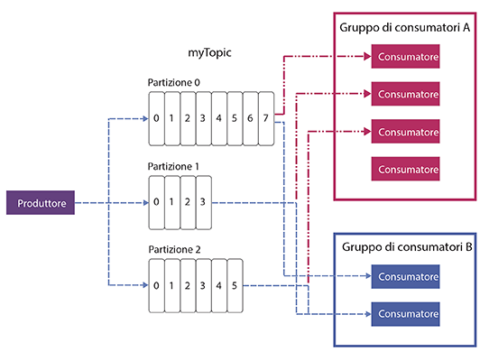

---

copyright:
  years: 2015, 2018
lastupdated: "2018-06-29"

---

{:new_window: target="_blank"}
{:shortdesc: .shortdesc}
{:screen: .screen}
{:codeblock: .codeblock}
{:pre: .pre}

# Concetti di Apache Kafka
{: #apache_kafka}

Il seguente elenco definisce alcun concetti di Apache Kafka:

<dl>
<dt>Server</dt>
<dd>Un'installazione Kafka è composta da una o più macchine server individuali. Tali server possono trovarsi in data center geograficamente eterogenei 
</dd>
 
<dt>Cluster</dt>
<dd>Kafka viene eseguito come un cluster di uno o più server. Il carico viene bilanciato in tutto il cluster distribuendolo tra i server.</dd>
 
<dt>Messaggio</dt>
<dd>L'unità di dati in Kafka. Ciascun messaggio è rappresentato come un record che si articola in due parti: chiave e valore. La chiave viene di solito usata per i dati relativi al messaggio e il valore è il corpo del messaggio. Kafka utilizza i termini record e messaggio in modo interscambiabile. 

Anche molti altri sistemi di messaggistica hanno un modo per trasportare altre informazioni insieme ai messaggi. A tale scopo, Kafka 0.11 introduce delle intestazioni di record, che sono supportate dal piano {{site.data.keyword.messagehub}} Enterprise. Il piano {{site.data.keyword.messagehub}} Standard è attualmente basato su Kafka 0.10.2.1, quindi non supporta ancora le intestazioni di record. 
 

Poiché molti strumenti nell'ecosistema Kafka (quali i connettori ad altri sistemi) utilizzano solo il valore e ignorano la chiave, è meglio inserire tutti i dati del messaggio nel valore e utilizzare la chiave solo per il partizionamento o la compattazione del log. Non devi contare sul fatto che tutte le applicazioni che leggono da Kafka facciano uso della chiave.
   </dd>
<dt>Argomento</dt>
<dd>Un flusso denominato di messaggi.</dd>
 
<dt>Partizione</dt>
<dd>Ogni argomento si articola in una o più partizioni. Ogni partizione è un elenco ordinato di messaggi. A ciascun messaggio su una partizione viene dato un numero, che aumenta in modo uniforme, detto offset. 

Ogni partizione ha un server nel cluster che funge da suo leader e altri server che fungono da follower.

Se un argomento ha più di una partizione, consente di eseguire il feed dei dati in parallelo per aumentare la velocità effettiva distribuendo le partizioni su tutto il cluster. Il numero di partizioni influenza anche il bilanciamento del carico di lavoro tra i consumatori.

Per ulteriori informazioni, vedi [Leadership della partizione](/docs/services/EventStreams/eventstreams118.html).</dd>
<dt>Produttore</dt>
<dd>Un processo che pubblica flussi di messaggi ad argomenti Kafka. Un produttore può eseguire
pubblicazioni per uno o più argomenti e può, facoltativamente, scegliere la partizione che memorizza i dati. </dd>
 
<dt>Consumatore </dt>
<dd>Un processo che utilizza messaggi dagli argomenti Kafka ed elabora il feed di messaggi. Un consumatore può consumare da uno o più argomenti o partizioni.</dd>
 
<dt>Gruppo di consumatori</dt>
<dd>Un gruppo denominato di uno o più consumatori che, insieme, consumano i messaggi da una serie di argomenti. Ciascun consumatore nel gruppo legge i messaggi da specifiche partizioni a cui è assegnato. Ogni partizione è assegnata solo a un singolo consumatore nel gruppo.
<ul>
<li>Se ci sono più partizioni che consumatori in un gruppo, alcuni consumatori hanno più partizioni.</li>
<li>Se ci sono più consumatori che partizioni, alcuni consumatori non hanno partizioni.</li>
</ul>
</dd>
</dl>

Per ulteriori informazioni, consultare le seguenti informazioni:
- [Produzione di messaggi](/docs/services/EventStreams/eventstreams112.html)
- [Consumo di messaggi](/docs/services/EventStreams/eventstreams114.html) 
- [Leadership della partizione](/docs/services/EventStreams/eventstreams118.html) 
- [Documentazione di Apache Kafka ](http://kafka.apache.org/documentation.html){:new_window} 

<!-- 27/06/18 Karen: removing - suggestion from James

## {{site.data.keyword.messagehub}} plans
{{site.data.keyword.messagehub}} is available as two different plans depending on your requirements: Standard and Enterprise.

* Choose the Standard plan if you want event ingest and distribution capabilities, where you pay for what you use and share infrastructure with others.
* Choose the Enterprise plan if data isolation, guaranteed performance, and increased retention are important considerations. 

For more information, see [Choosing your plan](/docs/services/EventStreams/eventstreams085.html).
-->

