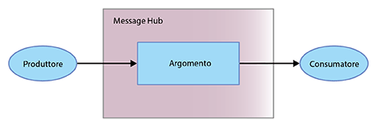

---

copyright:
  years: 2015, 2018
lastupdated: "2018-09-18"

---

{:new_window: target="_blank"}
{:shortdesc: .shortdesc}
{:screen: .screen}
{:codeblock: .codeblock}
{:pre: .pre}

# Introduzione a {{site.data.keyword.messagehub}} 
{: #getting_started}

Per iniziare a utilizzare {{site.data.keyword.messagehub}}
e a inviare e ricevere messaggi, puoi utilizzare l'esempio Java™. L'esempio mostra in che modo un produttore invia
i messaggi a un consumatore utilizzando un argomento. Viene utilizzato lo stesso programma di esempio sia per consumare che per produrre
i messaggi.

Per comprendere meglio la modalità di funzionamento di {{site.data.keyword.messagehub}}, vedi [Informazioni su {{site.data.keyword.messagehub}}](/docs/services/EventStreams/eventstreams010.html). {{site.data.keyword.messagehub}} era precedentemente conosciuto come Message Hub.

Per accedere ad altri esempi di {{site.data.keyword.messagehub}}, compresi quelli per Node.js e Python, vedi la pagina degli [esempi di {{site.data.keyword.messagehub}} ](https://github.com/ibm-messaging/event-streams-samples){:new_window}.

<!-- 11/01/18 - Karen - removing diagram as requested by James

-->

Completa la seguente procedura:
{: #getting_started_steps}
 
1. Crea un'istanza del servizio {{site.data.keyword.messagehub}}:

  a. Accedi alla console {{site.data.keyword.Bluemix_notm}}.  
  
  b. Fai clic su **Catalogo**.
  
  c. Nella sezione **Integrazione**, seleziona **Piano Standard {{site.data.keyword.messagehub}}**. Viene visualizzata la pagina dell'istanza del servizio {{site.data.keyword.messagehub}}.
  
  d. Immetti un nome per il tuo servizio. Puoi utilizzare il valore predefinito.
  
  e. Fai clic su **Crea**.

2. {: #create_credentials_step notoc} Crea alcune credenziali {{site.data.keyword.messagehub}} completando queste istruzioni: [Ottieni le credenziali e stabilisci la connessione utilizzando la console IBM Cloud](/docs/services/EventStreams/eventstreams127.html#connect_standard_cf_console).
   <br/>
   <br/>Avrai bisogno dei valori di *kafka_brokers_sasl*, *kafka_admin_url* e *api_key* per il [passo 7](/docs/services/EventStreams/index.html#start_consumer_step) di questa attività.   

3. Se non li hai ancora, installa i seguenti prerequisiti:

    * [git ](https://git-scm.com/){:new_window}
	* [Gradle ](https://gradle.org/){:new_window}
    * Java 8 o superiore
 
4. Clona il repository git event-streams-samples immettendo il seguente comando dalla riga di comando:

    <pre class="pre">
    git clone https://github.com/ibm-messaging/event-streams-samples.git
    </pre>
	{: codeblock}

5. Modifica la directory dell'esempio della console java immettendo il seguente comando:

    <pre class="pre">
    cd event-streams-samples/kafka-java-console-sample
    </pre>
	{: codeblock}

6. Esegui questi comandi build:

    <pre class="pre">
    gradle clean && gradle build
    </pre>
	{: codeblock}

7. {: #start_consumer_step notoc} Avvia il consumatore sulla tua console immettendo il seguente comando:

    <pre class="pre">java -jar build/libs/kafka-java-console-sample-2.0.jar 
	<var class="keyword varname">kafka_brokers_sasl</var> <var class="keyword varname">kafka_admin_url</var> token<var class="keyword varname">:api_key</var> -consumer</pre>
    {: codeblock}
    
    L'esempio utilizza un argomento denominato `kafka-java-console-sample-topic`. Se l'argomento non esiste
    già, viene creato dall'esempio utilizzando l'API di amministrazione {{site.data.keyword.messagehub}}. Per inviare e ricevere i
    messaggi, l'esempio usa l'API Java Apache Kafka.

    Utilizza i valori per *kafka_brokers_sasl*, *kafka_admin_url*
    e *api_key* dalle credenziali che hai creato nel [passo 2](/docs/services/MessageHub/index.html#create_credentials_step).
	
	Specifica <code>token</code> come tuo nome utente e la <var class="keyword varname">api_key</var> come tua password. Separa <code>token</code> e la <var class="keyword varname">api_key</var> con un carattere due punti.
    
	**Importante:** *kafka_brokers_sasl* deve essere una singola stringa e deve essere racchiusa tra virgolette. Ad esempio:

    <pre class="pre">
    "host1:port1,host2:port2"
    </pre>
	{: codeblock}

    Si consiglia di utilizzare tutti gli host Kafka elencati nelle **Credenziali** che hai selezionato.

8. Avvia il produttore sulla tua console immettendo il seguente comando:
   
    <pre class="pre">java -jar build/libs/kafka-java-console-sample-2.0.jar 
	<var class="keyword varname">kafka_brokers_sasl</var> <var class="keyword varname">kafka_admin_url</var> token<var class="keyword varname">:api_key</var> -producer</pre>
 {: codeblock}
  
9. Dovresti ora vedere i messaggi inviati dal produttore che compaiono nel consumatore. Di seguito è
riportato un output di esempio:

    ```
    [2018-07-02 14:54:50,788] INFO Running in local mode. (com.messagehub.samples.MessageHubConsoleSample)
    [2018-07-02 14:54:50,789] INFO Kafka Endpoints: kafka-0.mh-zarjkgtnzzspbkfrkqgdhmq.us-south.containers.appdomain.cloud:9093,kafka-1.mh-zarjkgtnzzspbkfrkqgdhmq.us-south.containers.appdomain.cloud:9093,kafka-2.mh-zarjkgtnzzspbkfrkqgdhmq.us-south.containers.appdomain.cloud:9093 (com.messagehub.samples.MessageHubConsoleSample)
    [2018-07-02 14:54:50,789] INFO Admin REST Endpoint: https://mh-zarjkgtnzzspbkfrkqgdhmq.us-south.containers.appdomain.cloud (com.messagehub.samples.MessageHubConsoleSample)
    [2018-07-02 14:54:50,789] INFO Creating the topic kafka-java-console-sample-topic (com.messagehub.samples.MessageHubConsoleSample)
    [2018-07-02 14:54:52,680] INFO Admin REST response : (com.messagehub.samples.MessageHubConsoleSample)
    [2018-07-02 14:54:53,351] INFO Admin REST Listing Topics: [{"name":"kafka-java-console-sample-topic","partitions":1,"retentionMs":86400000,"cleanupPolicy":"delete"},{"name":"__consumer_offsets","partitions":50,"retentionMs":86400000,"cleanupPolicy":"compact"}] (com.messagehub.samples.MessageHubConsoleSample)
    [2018-07-02 14:54:55,126] INFO [Partition(topic = kafka-java-console-sample-topic, partition = 0, leader = 0, replicas = [0,2,1], isr = [0,2,1], offlineReplicas = [])] (com.messagehub.samples.ConsumerRunnable)
    [2018-07-02 14:54:55,126] INFO class com.messagehub.samples.ConsumerRunnable is starting. (com.messagehub.samples.ConsumerRunnable)
    [2018-07-02 14:54:56,328] INFO [Partition(topic = kafka-java-console-sample-topic, partition = 0, leader = 0, replicas = [0,2,1], isr = [0,2,1], offlineReplicas = [])] (com.messagehub.samples.ProducerRunnable)
    [2018-07-02 14:54:56,328] INFO MessageHubConsoleSample will run until interrupted. (com.messagehub.samples.MessageHubConsoleSample)
    [2018-07-02 14:54:56,328] INFO class com.messagehub.samples.ProducerRunnable is starting. (com.messagehub.samples.ProducerRunnable)
    [2018-07-02 14:54:57,514] INFO Message produced, offset: 0 (com.messagehub.samples.ProducerRunnable)
    [2018-07-02 14:54:59,652] INFO Message produced, offset: 1 (com.messagehub.samples.ProducerRunnable)
    [2018-07-02 14:55:00,671] INFO No messages consumed (com.messagehub.samples.ConsumerRunnable)
    [2018-07-02 14:55:01,788] INFO Message produced, offset: 2 (com.messagehub.samples.ProducerRunnable)
    [2018-07-02 14:55:01,797] INFO Message consumed: ConsumerRecord(topic = kafka-java-console-sample-topic, partition = 0, offset = 2, CreateTime = 1530539701655, serialized key size = 3, serialized value size = 25, headers = RecordHeaders(headers = [], isReadOnly = false), key = key, value = This is a test message #2) (com.messagehub.samples.ConsumerRunnable)
    [2018-07-02 14:55:03,921] INFO Message consumed: ConsumerRecord(topic = kafka-java-console-sample-topic, partition = 0, offset = 3, CreateTime = 1530539703789, serialized key size = 3, serialized value size = 25, headers = RecordHeaders(headers = [], isReadOnly = false), key = key, value = This is a test message #3) (com.messagehub.samples.ConsumerRunnable)
    [2018-07-02 14:55:03,921] INFO Message produced, offset: 3 (com.messagehub.samples.ProducerRunnable)
    [2018-07-02 14:55:06,053] INFO Message consumed: ConsumerRecord(topic = kafka-java-console-sample-topic, partition = 0, offset = 4, CreateTime = 1530539705922, serialized key size = 3, serialized value size = 25, headers = RecordHeaders(headers = [], isReadOnly = false), key = key, value = This is a test message #4) (com.messagehub.samples.ConsumerRunnable)
    [2018-07-02 14:55:06,054] INFO Message produced, offset: 4 (com.messagehub.samples.ProducerRunnable)
    [2018-07-02 14:55:08,186] INFO Message consumed: ConsumerRecord(topic = kafka-java-console-sample-topic, partition = 0, offset = 5, CreateTime = 1530539708055, serialized key size = 3, serialized value size = 25, headers = RecordHeaders(headers = [], isReadOnly = false), key = key, value = This is a test message #5) (com.messagehub.samples.ConsumerRunnable)
    ```
	{: codeblock}
	
10. L'esempio viene eseguito indefinitamente finché non viene arrestato. Per arrestare il processo, esegui un comando simile
a questo: <code>Ctrl+C</code>

<!-- 07/06/18 - Karen: removing until a newer version available
To watch a video that walks
you through getting a Java sample to run against {{site.data.keyword.messagehub}}, see [{{site.data.keyword.messagehub}} - Getting started with IBM's Kafka in the cloud ](https://www.youtube.com/watch?v=tt-bLtFzC_4){:new_window}.
-->


