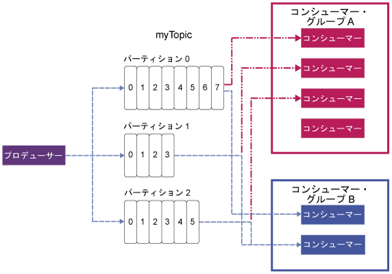

---

copyright:
  years: 2015, 2019
lastupdated: "2019-01-23"

keywords: IBM Event Streams, Kafka as a service, managed Apache Kafka

subcollection: eventstreams

---

{:new_window: target="_blank"}
{:shortdesc: .shortdesc}
{:screen: .screen}
{:codeblock: .codeblock}
{:pre: .pre}

# Apache Kafka の概念
{: #apache_kafka}

以下に、Apache Kafka の概念をいくつか定義してリストします。

<dl>
<dt>サーバー</dt>
<dd>Kafka インストール済み環境は 1 つ以上の個別のサーバー・マシンからなります。 これらのサーバーは地理的に離れたデータ・センターに置くことができます。 
</dd>
 
<dt>クラスター</dt>
<dd>Kafka は 1 つ以上のサーバーのクラスターとして実行されます。 負荷は、それらのサーバーに分散されることで、クラスター全体で平衡されます。</dd>
 
<dt>メッセージ</dt>
<dd>Kafka におけるデータの単位。 各メッセージが 1 つのレコードとして表され、レコードはキーと値の 2 つの部分からなります。 キーは一般的にメッセージに関するデータ用に使用され、値はメッセージ本体です。 Kafka ではレコードいう用語とメッセージという用語が区別せずに使用されています。 

その他の多くのメッセージング・システムにも、他の情報をメッセージと共に受け渡す方法があります。 この目的のために、{{site.data.keyword.messagehub}} でサポートされるレコード・ヘッダーが Kafka 0.11 で導入されています。  
 

Kafka エコシステム内の多くのツール (他のシステムへのコネクターなど) は、値のみを使用し、キーを無視します。そのため、メッセージ・データのすべてを値に入れ、パーティショニングまたはログ圧縮のためにのみキーを使用するのが最良です。 キーを使用するために Kafka から読み取りを行うものに依存してはなりません。
   </dd>
<dt>トピック</dt>
<dd>名前付きのメッセージ・ストリーム。</dd>
 
<dt>パーティション</dt>
<dd>各トピックは、1 つ以上のパーティションから成ります。 各パーティションは、メッセージの順序付きリストです。 パーティションにあるメッセージのそれぞれに、オフセットと呼ばれる単調に増加する数値が付与されます。 

各パーティションで、クラスター内の 1 つのサーバーがパーティションのリーダーとして動作し、その他のサーバーはフォロワーとして動作します。

1 つのトピックに複数のパーティションがある場合、クラスター全体でそれらのパーティションを配分することによって、データを並行してフィードし、スループットを向上させることができます。 パーティションの数は、コンシューマー間の作業負荷のバランシングにも影響します。

詳しくは、[パーティションのリーダー](/docs/services/EventStreams?topic=eventstreams-partition_leadership#partition_leadership)を参照してください。</dd>
<dt>プロデューサー</dt>
<dd>Kafka トピックにメッセージのストリームをパブリッシュするプロセス。 プロデューサーは、1 つ以上のトピックにパブリッシュすることができます。
また、オプションで、データを格納するパーティションを選択できます。 </dd>
 
<dt>コンシューマー </dt>
<dd>Kafka トピックからメッセージをコンシュームし、メッセージのフィードを処理するプロセス。 1 つのコンシューマーが 1 つ以上のトピックまたはパーティションからコンシュームできます。</dd>
 
<dt>コンシューマー・グループ</dt>
<dd>トピックのセットから一緒にメッセージのコンシュームを行う 1 つ以上のコンシューマーからなる名前付きグループ。 グループ内の各コンシューマーは、割り当てられた特定のパーティションからメッセージを読み取ります。 各パーティションは、グループ内の 1 つのコンシューマーにのみ割り当てられます。
<ul>
<li>グループにコンシューマーより多くのパーティションがある場合、複数のパーティションを持つコンシューマーがあります。</li>
<li>パーティションより多くのコンシューマーがある場合、パーティションを持たないコンシューマーがあります。</li>
</ul>
</dd>
</dl>

詳細については、以下の資料を参照してください。
- [メッセージのプロデュース](/docs/services/EventStreams?topic=eventstreams-producing_messages#producing_messages)
- [メッセージのコンシューム](/docs/services/EventStreams?topic=eventstreams-consuming_messages#consuming_messages) 
- [パーティションのリーダー](/docs/services/EventStreams?topic=eventstreams-partition_leadership#partition_leadership) 
- [Apache Kafka 資料 ](http://kafka.apache.org/documentation.html){:new_window} 

<!-- 27/06/18 Karen: removing - suggestion from James

## {{site.data.keyword.messagehub}} plans
{{site.data.keyword.messagehub}} is available as two different plans depending on your requirements: Standard and Enterprise.

* Choose the Standard plan if you want event ingest and distribution capabilities, where you pay for what you use and share infrastructure with others.
* Choose the Enterprise plan if data isolation, guaranteed performance, and increased retention are important considerations. 

For more information, see [Choosing your plan](/docs/services/EventStreams/eventstreams085.html).
-->

