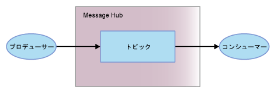

---

copyright:
  years: 2015, 2018
lastupdated: "2018-09-18"

---

{:new_window: target="_blank"}
{:shortdesc: .shortdesc}
{:screen: .screen}
{:codeblock: .codeblock}
{:pre: .pre}

# {{site.data.keyword.messagehub}} 入門 
{: #getting_started}

{{site.data.keyword.messagehub}} を開始し、メッセージの送受信を開始するには、Java™ サンプルを使用できます。 このサンプルは、プロデューサーがトピックを使用してメッセージをコンシューマーに送信する方法を示します。 同じサンプル・プログラムが、メッセージのコンシュームとメッセージのプロデュースに使用されます。

{{site.data.keyword.messagehub}} がどのように機能するのかについて詳しくは、[{{site.data.keyword.messagehub}} について](/docs/services/EventStreams/eventstreams010.html)を参照してください。{{site.data.keyword.messagehub}} は、以前は Message Hub と呼ばれていました。

Node.js および Python のサンプルを含め、他の {{site.data.keyword.messagehub}} サンプルにアクセスするには、[{{site.data.keyword.messagehub}} サンプル ](https://github.com/ibm-messaging/event-streams-samples){:new_window} を参照してください。

<!-- 11/01/18 - Karen - removing diagram as requested by James

-->

以下のステップを実行してください。
{: #getting_started_steps}
 
1. {{site.data.keyword.messagehub}} サービス・インスタンスを作成します。

  a. {{site.data.keyword.Bluemix_notm}} コンソールにログインします。 
  
  b. **「カタログ」**をクリックします。
  
  c. **「統合」**セクションで、**{{site.data.keyword.messagehub}}「標準プラン」**を選択します。{{site.data.keyword.messagehub}} サービス・インスタンス・ページが開きます。
  
  d. サービスの名前を入力します。デフォルト値を使用することができます。
  
  e. **「作成」**をクリックします。

2. {: #create_credentials_step notoc}[IBM Cloud コンソールを使用した資格情報の取得および接続](/docs/services/EventStreams/eventstreams127.html#connect_standard_cf_console)のステップを実行して、{{site.data.keyword.messagehub}} の資格情報を作成します。
   <br/>
   <br/>このタスクの[ステップ 7](/docs/services/EventStreams/index.html#start_consumer_step) で、*kafka_brokers_sasl*、*kafka_admin_url*、および *api_key* の値が必要になります。   

3. 前提条件である以下の製品がまだインストールされていない場合はインストールします。

    * [git ](https://git-scm.com/){:new_window}
	* [Gradle ](https://gradle.org/){:new_window}
    * Java 8 以上
 
4. コマンド・ラインから次のコマンドを実行して、event-streams-samples Git リポジトリーを複製します。

    <pre class="pre">
    git clone https://github.com/ibm-messaging/event-streams-samples.git
    </pre>
	{: codeblock}

5. 次のコマンドを実行して、ディレクトリーを java console sample に変更します。

    <pre class="pre">
    cd event-streams-samples/kafka-java-console-sample
    </pre>
	{: codeblock}

6. 次のビルド・コマンドを実行します。

    <pre class="pre">
    gradle clean && gradle build
    </pre>
	{: codeblock}

7. {: #start_consumer_step notoc}次のコマンドを実行して、ご使用のコンソールでコンシューマーを開始します。

    <pre class="pre">java -jar build/libs/kafka-java-console-sample-2.0.jar 
	<var class="keyword varname">kafka_brokers_sasl</var> <var class="keyword varname">kafka_admin_url</var> token<var class="keyword varname">:api_key</var> -consumer</pre>
    {: codeblock}
    
    このサンプルでは、`kafka-java-console-sample-topic` という名前のトピックが使用されます。 このトピックがまだ存在していない場合、このサンプルは {{site.data.keyword.messagehub}} 管理 API を使用して作成します。 このサンプルは、メッセージの送受信には Apache Kafka Java API を使用します。

    [ステップ 2](/docs/services/MessageHub/index.html#create_credentials_step) で作成した資格情報の、*kafka_brokers_sasl*、*kafka_admin_url*、および *api_key* の値を使用します。
	
	ユーザー名として <code>token</code> を、パスワードとして <var class="keyword varname">api_key</var> を指定します。 <code>token</code> と <var class="keyword varname">api_key</var> はコロンで区切ってください。
    
	**重要:** *kafka_brokers_sasl* は、単一ストリングでなければならず、引用符で囲む必要があります。 以下に例を示します。

    <pre class="pre">
    "host1:port1,host2:port2"
    </pre>
	{: codeblock}

    選択した**資格情報**にリストされているすべての Kafka ホストを使用することをお勧めします。

8. 次のコマンドを実行して、ご使用のコンソールでプロデューサーを開始します。
   
    <pre class="pre">java -jar build/libs/kafka-java-console-sample-2.0.jar 
	<var class="keyword varname">kafka_brokers_sasl</var> <var class="keyword varname">kafka_admin_url</var> token<var class="keyword varname">:api_key</var> -producer</pre>
 {: codeblock}
  
9. これで、プロデューサーによって送信されたメッセージがコンシューマーで表示されるようになります。 次に出力例の一部を示します。

    ```
    [2018-07-02 14:54:50,788] INFO Running in local mode. (com.messagehub.samples.MessageHubConsoleSample)
    [2018-07-02 14:54:50,789] INFO Kafka Endpoints: kafka-0.mh-zarjkgtnzzspbkfrkqgdhmq.us-south.containers.appdomain.cloud:9093,kafka-1.mh-zarjkgtnzzspbkfrkqgdhmq.us-south.containers.appdomain.cloud:9093,kafka-2.mh-zarjkgtnzzspbkfrkqgdhmq.us-south.containers.appdomain.cloud:9093 (com.messagehub.samples.MessageHubConsoleSample)
    [2018-07-02 14:54:50,789] INFO Admin REST Endpoint: https://mh-zarjkgtnzzspbkfrkqgdhmq.us-south.containers.appdomain.cloud (com.messagehub.samples.MessageHubConsoleSample)
    [2018-07-02 14:54:50,789] INFO Creating the topic kafka-java-console-sample-topic (com.messagehub.samples.MessageHubConsoleSample)
    [2018-07-02 14:54:52,680] INFO Admin REST response : (com.messagehub.samples.MessageHubConsoleSample)
    [2018-07-02 14:54:53,351] INFO Admin REST Listing Topics: [{"name":"kafka-java-console-sample-topic","partitions":1,"retentionMs":86400000,"cleanupPolicy":"delete"},{"name":"__consumer_offsets","partitions":50,"retentionMs":86400000,"cleanupPolicy":"compact"}] (com.messagehub.samples.MessageHubConsoleSample)
    [2018-07-02 14:54:55,126] INFO [Partition(topic = kafka-java-console-sample-topic, partition = 0, leader = 0, replicas = [0,2,1], isr = [0,2,1], offlineReplicas = [])] (com.messagehub.samples.ConsumerRunnable)
    [2018-07-02 14:54:55,126] INFO class com.messagehub.samples.ConsumerRunnable is starting. (com.messagehub.samples.ConsumerRunnable)
    [2018-07-02 14:54:56,328] INFO [Partition(topic = kafka-java-console-sample-topic, partition = 0, leader = 0, replicas = [0,2,1], isr = [0,2,1], offlineReplicas = [])] (com.messagehub.samples.ProducerRunnable)
    [2018-07-02 14:54:56,328] INFO MessageHubConsoleSample will run until interrupted. (com.messagehub.samples.MessageHubConsoleSample)
    [2018-07-02 14:54:56,328] INFO class com.messagehub.samples.ProducerRunnable is starting. (com.messagehub.samples.ProducerRunnable)
    [2018-07-02 14:54:57,514] INFO Message produced, offset: 0 (com.messagehub.samples.ProducerRunnable)
    [2018-07-02 14:54:59,652] INFO Message produced, offset: 1 (com.messagehub.samples.ProducerRunnable)
    [2018-07-02 14:55:00,671] INFO No messages consumed (com.messagehub.samples.ConsumerRunnable)
    [2018-07-02 14:55:01,788] INFO Message produced, offset: 2 (com.messagehub.samples.ProducerRunnable)
    [2018-07-02 14:55:01,797] INFO Message consumed: ConsumerRecord(topic = kafka-java-console-sample-topic, partition = 0, offset = 2, CreateTime = 1530539701655, serialized key size = 3, serialized value size = 25, headers = RecordHeaders(headers = [], isReadOnly = false), key = key, value = This is a test message #2) (com.messagehub.samples.ConsumerRunnable)
    [2018-07-02 14:55:03,921] INFO Message consumed: ConsumerRecord(topic = kafka-java-console-sample-topic, partition = 0, offset = 3, CreateTime = 1530539703789, serialized key size = 3, serialized value size = 25, headers = RecordHeaders(headers = [], isReadOnly = false), key = key, value = This is a test message #3) (com.messagehub.samples.ConsumerRunnable)
    [2018-07-02 14:55:03,921] INFO Message produced, offset: 3 (com.messagehub.samples.ProducerRunnable)
    [2018-07-02 14:55:06,053] INFO Message consumed: ConsumerRecord(topic = kafka-java-console-sample-topic, partition = 0, offset = 4, CreateTime = 1530539705922, serialized key size = 3, serialized value size = 25, headers = RecordHeaders(headers = [], isReadOnly = false), key = key, value = This is a test message #4) (com.messagehub.samples.ConsumerRunnable)
    [2018-07-02 14:55:06,054] INFO Message produced, offset: 4 (com.messagehub.samples.ProducerRunnable)
    [2018-07-02 14:55:08,186] INFO Message consumed: ConsumerRecord(topic = kafka-java-console-sample-topic, partition = 0, offset = 5, CreateTime = 1530539708055, serialized key size = 3, serialized value size = 25, headers = RecordHeaders(headers = [], isReadOnly = false), key = key, value = This is a test message #5) (com.messagehub.samples.ConsumerRunnable)
    ```
	{: codeblock}
	
10. このサンプルは、ユーザーが停止するまで無期限に実行されます。 処理を停止するには、<code>Ctrl+C</code> のようなコマンドを実行します。

<!-- 07/06/18 - Karen: removing until a newer version available
To watch a video that walks
you through getting a Java sample to run against {{site.data.keyword.messagehub}}, see [{{site.data.keyword.messagehub}} - Getting started with IBM's Kafka in the cloud ](https://www.youtube.com/watch?v=tt-bLtFzC_4){:new_window}.
-->


