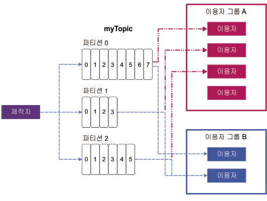

---

copyright:
  years: 2015, 2019
lastupdated: "2019-01-23"

keywords: IBM Event Streams, Kafka as a service, managed Apache Kafka

subcollection: eventstreams

---

{:new_window: target="_blank"}
{:shortdesc: .shortdesc}
{:screen: .screen}
{:codeblock: .codeblock}
{:pre: .pre}

# Apache Kafka 개념
{: #apache_kafka}

다음 목록은 일부 Apache Kafka 개념을 정의합니다.

<dl>
<dt>서버</dt>
<dd>Kafka 설치는 한 개 이상의 개별 서버 머신으로 구성됩니다. 이 서버는 지리적으로 다른 데이터 센터에 위치할 수 있습니다. 
</dd>
 
<dt>클러스터</dt>
<dd>Kafka는 하나 이상의 서버의 클러스터로 실행됩니다. 로드는 서버 사이에 분배하여 클러스터 전체에서 밸런싱됩니다.</dd>
 
<dt>메시지</dt>
<dd>Kafka의 데이터 단위입니다. 각 메시지는 두 파트(키와 값)로 구성된 레코드로 표시됩니다. 키는 일반적으로 메시지에 대한 데이터에 사용되며 값은 메시지의 본문입니다. Kafka에서는 '레코드'라는 용어와 '메시지'라는 용어를 상호 교환적으로 사용합니다. 

기타 많은 메시징 시스템에도 메시지와 함께 다른 정보를 전달하는 방법이 있습니다. Kafka 0.11은 이를 위해 레코드 헤더를 도입했으며 {{site.data.keyword.messagehub}}에서 지원합니다.  
 

Kafka 에코시스템의 많은 도구(예: 다른 시스템에 대한 커넥터)가 값만 사용하고 키는 무시하므로, 값에 모든 메시지 데이터를 넣고 파티셔닝 또는 로그 압축에는 키를 사용하는 것이 좋습니다. 키를 사용하는 데 Kafka에서 읽는 모든 내용이 필요하지는 않습니다.
   </dd>
<dt>토픽</dt>
<dd>메시지의 이름 지정된 스트림입니다.</dd>
 
<dt>파티션</dt>
<dd>각 토픽은 하나 이상의 파티션으로 구성됩니다. 각 파티션은 메시지의 정렬된 목록입니다. 파티션의 메시지에는 각각 일정하게 증가하는 숫자(오프셋)가 지정됩니다. 

각 파티션에는 파티션의 리더 역할을 하는 클러스터의 서버 하나와 팔로워의 역할을 하는 다른 서버들이 있습니다.

토픽에 둘 이상의 파티션이 있으면 클러스터에 파티션을 분배하여 처리량을 높이기 위해 병렬로 데이터가 피드될 수 있도록 허용합니다. 또한 파티션의 수는 이용자 간 워크로드 밸런싱에 영향을 줍니다.

자세한 정보는 [파티션 리더십](/docs/services/EventStreams?topic=eventstreams-partition_leadership#partition_leadership)을 참조하십시오.</dd>
<dt>제작자</dt>
<dd>Kafka 토픽에 메시지 스트림을 공개하는 프로세스입니다. 제작자는 하나 이상의 토픽에 대해 공개할 수 있으며 선택적으로 데이터를 저장하는 파티션을 선택할 수 있습니다.</dd>
 
<dt>이용자 </dt>
<dd>Kafka 토픽의 메시지를 이용하고 메시지의 피드를 처리하는 프로세스입니다. 이용자는 하나 이상의 토픽 또는 파티션에서 이용할 수 있습니다.</dd>
 
<dt>이용자 그룹</dt>
<dd>토픽 세트에서 메시지를 함께 이용하는 하나 이상의 이용자의 이름 지정된 그룹입니다. 그룹의 각 이용자는 지정된 특정 파티션에서 메시지를 읽습니다. 각 파티션은 그룹의 한 이용자에게만 지정됩니다.
<ul>
<li>그룹의 이용자보다 많은 파티션이 있을 경우 일부 이용자는 복수의 파티션을 가집니다.</li>
<li>파티션보다 많은 이용자가 있을 경우 일부 이용자는 파티션이 없습니다.</li>
</ul>
</dd>
</dl>

자세히 보려면 다음 정보를 참조하십시오.
- [메시지 생성](/docs/services/EventStreams?topic=eventstreams-producing_messages#producing_messages)
- [메시지 이용](/docs/services/EventStreams?topic=eventstreams-consuming_messages#consuming_messages) 
- [파티션 리더십](/docs/services/EventStreams?topic=eventstreams-partition_leadership#partition_leadership) 
- [Apache Kafka 문서 ](http://kafka.apache.org/documentation.html){:new_window} 

<!-- 27/06/18 Karen: removing - suggestion from James

## {{site.data.keyword.messagehub}} plans
{{site.data.keyword.messagehub}} is available as two different plans depending on your requirements: Standard and Enterprise.

* Choose the Standard plan if you want event ingest and distribution capabilities, where you pay for what you use and share infrastructure with others.
* Choose the Enterprise plan if data isolation, guaranteed performance, and increased retention are important considerations. 

For more information, see [Choosing your plan](/docs/services/EventStreams/eventstreams085.html).
-->

