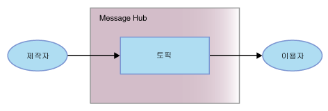

---

copyright:
  years: 2015, 2019
lastupdated: "2019-05-08"

keywords: IBM Event Streams, Kafka as a service, managed Apache Kafka

subcollection: eventstreams

---

{:new_window: target="_blank"}
{:shortdesc: .shortdesc}
{:screen: .screen}
{:codeblock: .codeblock}
{:pre: .pre}
{:note: .note}

# 시작하기 튜토리얼
{: #getting_started}

{{site.data.keyword.messagehub}}를 시작하여
메시지 전송 및 수신을 시작하기 위해 Java™ 샘플을 사용할 수 있습니다. 샘플에서는 제작자가 토픽을 사용하여
이용자에게 메시지를 보내는 방법을 보여줍니다. 메시지를 이용하고 메시지를 생성하는 데 동일한 샘플 프로그램이 사용됩니다.
{: shortdesc}

{{site.data.keyword.messagehub}}가 어떻게 작동하는지 더 자세히 알아보려면 [{{site.data.keyword.messagehub}} 정보](/docs/services/EventStreams?topic=eventstreams-about)를 참조하십시오. {{site.data.keyword.messagehub}}의 이전 이름은 Message Hub입니다.

Node.js 및 Python의 샘플을 포함해 기타 {{site.data.keyword.messagehub}} 샘플에 액세스하려면 [{{site.data.keyword.messagehub}} 샘플](https://github.com/ibm-messaging/event-streams-samples){:new_window}을 참조하십시오.

<!-- 11/01/18 - Karen - removing diagram as requested by James

-->

다음 단계를 완료하십시오.
{: #getting_started_steps}
 
1. {{site.data.keyword.messagehub}} 서비스 인스턴스를 작성하십시오.

  a. {{site.data.keyword.Bluemix_notm}} 콘솔에 로그인하십시오. 
  
  b. **카탈로그**를 클릭하십시오.
  
  c. **통합** 섹션에서 {{site.data.keyword.messagehub}} 타일을 클릭한 후 **표준 플랜**을 선택하십시오. {{site.data.keyword.messagehub}} 서비스 인스턴스 페이지가 열립니다.
  
  d. 서비스의 이름을 입력하십시오. 기본값을 사용할 수 있습니다.
  
  e. **작성**을 클릭하십시오.

2. {: #create_credentials_step notoc} 몇 가지 {{site.data.keyword.messagehub}} 인증 정보를 작성하기 위해 [IBM Cloud 콘솔을 사용하여 인증 정보 가져오기 및 연결](/docs/services/EventStreams?topic=eventstreams-connecting#connect_enterprise_external_console) 단계를 완료하십시오.
   <br/>
   <br/>이 태스크의 [7단계](/docs/services/EventStreams?topic=eventstreams-getting_started#start_consumer_step)를 수행하려면 *kafka_brokers_sasl* 및 *api_key*의 값이 필요합니다.   

3. 아직 설치되어 있지 않다면, 다음 필수 소프트웨어를 설치하십시오.

    * [git ](https://git-scm.com/){:new_window}
	* [Gradle ](https://gradle.org/){:new_window}
    * Java 8 이상
 
4. 명령행에서 다음 명령을 실행하여 event-streams-samples git 저장소를 복제하십시오.

    <pre class="pre">
    git clone https://github.com/ibm-messaging/event-streams-samples.git
    </pre>

5. 다음 명령을 실행하여 java 콘솔 샘플로 디렉토리를 변경하십시오.

    <pre class="pre">
    cd event-streams-samples/kafka-java-console-sample
    </pre>

6. 다음 빌드 명령을 실행하십시오.

    <pre class="pre">
    gradle clean && gradle build
    </pre>

7. {: #start_consumer_step notoc}다음 명령을 실행하여 콘솔에서 이용자를 시작하십시오.

    <pre class="pre">java -jar ./build/libs/kafka-java-console-sample-2.0.jar
	<var class="keyword varname">kafka_brokers_sasl</var> <var class="keyword varname">api_key</var> -consumer</pre>
    
    샘플은 `kafka-java-console-sample-topic`으로 이름 지정된 토픽을 사용합니다. 토픽이 아직 없는 경우
    샘플은 {{site.data.keyword.messagehub}} 관리 API를 사용하여 토픽을 작성합니다. 메시지를 전송 및 수신하기 위해
    샘플은 Apache Kafka Java API를 사용합니다.

    [2단계](/docs/services/EventStreams?topic=eventstreams-getting_started#create_credentials_step)에서 작성한 인증 정보의 *kafka_brokers_sasl* 및 *api_key* 값을 사용하십시오.
	<p></p>

	**중요:** *kafka_brokers_sasl*은 단일 문자열이어야 하며 따옴표로 묶어야 합니다. 예를 들어, 다음과 같은 경우입니다.

    <pre class="pre">
    "host1:port1,host2:port2"
    </pre>

    선택한 **인증 정보**에 나열된 모든 Kafka 호스트 사용을 권장합니다.

8. 다음 명령을 실행하여 콘솔에서 제작자를 시작하십시오.
   
    <pre class="pre">java -jar ./build/libs/kafka-java-console-sample-2.0.jar
	<var class="keyword varname">kafka_brokers_sasl</var> <var class="keyword varname">api_key</var> -producer</pre>
  
9. 이제 이용자에 표시되는 제작자가 보낸 메시지를 볼 수 있습니다. 일부 샘플 출력은 다음과 같습니다.

    ```
[2018-07-02 14:54:50,788] INFO Running in local mode. (com.messagehub.samples.MessageHubConsoleSample)
    [2018-07-02 14:54:50,789] INFO Kafka Endpoints: kafka-0.mh-zarjkgtnzzspbkfrkqgdhmq.us-south.containers.appdomain.cloud:9093,kafka-1.mh-zarjkgtnzzspbkfrkqgdhmq.us-south.containers.appdomain.cloud:9093,kafka-2.mh-zarjkgtnzzspbkfrkqgdhmq.us-south.containers.appdomain.cloud:9093 (com.messagehub.samples.MessageHubConsoleSample)
    [2018-07-02 14:54:50,789] INFO Admin REST Endpoint: https://mh-zarjkgtnzzspbkfrkqgdhmq.us-south.containers.appdomain.cloud (com.messagehub.samples.MessageHubConsoleSample)
    [2018-07-02 14:54:50,789] INFO Creating the topic kafka-java-console-sample-topic (com.messagehub.samples.MessageHubConsoleSample)
    [2018-07-02 14:54:52,680] INFO Admin REST response : (com.messagehub.samples.MessageHubConsoleSample)
    [2018-07-02 14:54:53,351] INFO Admin REST Listing Topics: [{"name":"kafka-java-console-sample-topic","partitions":1,"retentionMs":86400000,"cleanupPolicy":"delete"},{"name":"__consumer_offsets","partitions":50,"retentionMs":86400000,"cleanupPolicy":"compact"}] (com.messagehub.samples.MessageHubConsoleSample)
    [2018-07-02 14:54:55,126] INFO [Partition(topic = kafka-java-console-sample-topic, partition = 0, leader = 0, replicas = [0,2,1], isr = [0,2,1], offlineReplicas = [])] (com.messagehub.samples.ConsumerRunnable)
    [2018-07-02 14:54:55,126] INFO class com.messagehub.samples.ConsumerRunnable is starting. (com.messagehub.samples.ConsumerRunnable)
    [2018-07-02 14:54:56,328] INFO [Partition(topic = kafka-java-console-sample-topic, partition = 0, leader = 0, replicas = [0,2,1], isr = [0,2,1], offlineReplicas = [])] (com.messagehub.samples.ProducerRunnable)
    [2018-07-02 14:54:56,328] INFO MessageHubConsoleSample will run until interrupted. (com.messagehub.samples.MessageHubConsoleSample)
    [2018-07-02 14:54:56,328] INFO class com.messagehub.samples.ProducerRunnable is starting. (com.messagehub.samples.ProducerRunnable)
    [2018-07-02 14:54:57,514] INFO Message produced, offset: 0 (com.messagehub.samples.ProducerRunnable)
    [2018-07-02 14:54:59,652] INFO Message produced, offset: 1 (com.messagehub.samples.ProducerRunnable)
    [2018-07-02 14:55:00,671] INFO No messages consumed (com.messagehub.samples.ConsumerRunnable)
    [2018-07-02 14:55:01,788] INFO Message produced, offset: 2 (com.messagehub.samples.ProducerRunnable)
    [2018-07-02 14:55:01,797] INFO Message consumed: ConsumerRecord(topic = kafka-java-console-sample-topic, partition = 0, offset = 2, CreateTime = 1530539701655, serialized key size = 3, serialized value size = 25, headers = RecordHeaders(headers = [], isReadOnly = false), key = key, value = This is a test message #2) (com.messagehub.samples.ConsumerRunnable)
    [2018-07-02 14:55:03,921] INFO Message consumed: ConsumerRecord(topic = kafka-java-console-sample-topic, partition = 0, offset = 3, CreateTime = 1530539703789, serialized key size = 3, serialized value size = 25, headers = RecordHeaders(headers = [], isReadOnly = false), key = key, value = This is a test message #3) (com.messagehub.samples.ConsumerRunnable)
    [2018-07-02 14:55:03,921] INFO Message produced, offset: 3 (com.messagehub.samples.ProducerRunnable)
    [2018-07-02 14:55:06,053] INFO Message consumed: ConsumerRecord(topic = kafka-java-console-sample-topic, partition = 0, offset = 4, CreateTime = 1530539705922, serialized key size = 3, serialized value size = 25, headers = RecordHeaders(headers = [], isReadOnly = false), key = key, value = This is a test message #4) (com.messagehub.samples.ConsumerRunnable)
    [2018-07-02 14:55:06,054] INFO Message produced, offset: 4 (com.messagehub.samples.ProducerRunnable)
    [2018-07-02 14:55:08,186] INFO Message consumed: ConsumerRecord(topic = kafka-java-console-sample-topic, partition = 0, offset = 5, CreateTime = 1530539708055, serialized key size = 3, serialized value size = 25, headers = RecordHeaders(headers = [], isReadOnly = false), key = key, value = This is a test message #5) (com.messagehub.samples.ConsumerRunnable)
    ```
	{: codeblock}
	
10. 샘플은 사용자가 중지할 때까지 계속 실행됩니다. 프로세스를 중지하려면 <code>Ctrl+C</code>와 같은 명령을 실행하십시오.

<!-- 07/06/18 - Karen: removing until a newer version available
To watch a video that walks
you through getting a Java sample to run against {{site.data.keyword.messagehub}}, see [{{site.data.keyword.messagehub}} - Getting started with IBM's Kafka in the cloud ](https://www.youtube.com/watch?v=tt-bLtFzC_4){:new_window}.
-->


