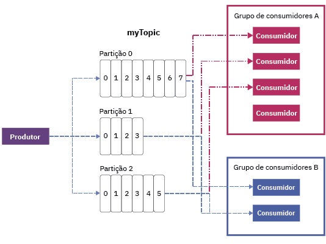

---

copyright:
  years: 2015, 2019
lastupdated: "2019-01-23"

keywords: IBM Event Streams, Kafka as a service, managed Apache Kafka

subcollection: eventstreams

---

{:new_window: target="_blank"}
{:shortdesc: .shortdesc}
{:screen: .screen}
{:codeblock: .codeblock}
{:pre: .pre}

# Conceitos do Apache Kafka
{: #apache_kafka}

A lista a seguir define alguns conceitos do Apache Kafka:

<dl>
<dt>Servidor</dt>
<dd>Uma instalação do Kafka é composta de uma ou mais máquinas servidor individuais. Esses servidores podem estar localizados em
data centers geograficamente díspares. 
</dd>
 
<dt>Cluster</dt>
<dd>O Kafka é executado como um cluster de um ou mais servidores. A carga é balanceada no cluster
distribuindo-a entre os servidores.</dd>
 
<dt>Mensagem</dt>
<dd>A unidade de dados no Kafka. Cada mensagem é representada como um registro, que inclui duas partes: chave
e valor. A chave é comumente usada para dados sobre a mensagem e o valor é o corpo da mensagem. O Kafka usa os temos registro e mensagem de forma intercambiável. 

Muitos outros sistemas de mensagens também têm uma forma de carregar outras informações juntamente com as mensagens. Para esse propósito, o Kafka 0.11 apresenta cabeçalhos de registro que são suportados pelo {{site.data.keyword.messagehub}}.  
 

Como muitas ferramentas no ecossistema do Kafka (como conectores para outros sistemas) usam apenas o valor e ignoram a chave, é melhor colocar todos os dados da mensagem no valor e apenas usar a chave para particionamento ou compactação de log. Você não deve confiar em tudo que lê no Kafka para usar a chave.
   </dd>
<dt>Tópico</dt>
<dd>Um fluxo nomeado de mensagens.</dd>
 
<dt>Partição</dt>
<dd>Cada tópico abrange uma ou mais partições. Cada partição está em uma lista ordenada de
            mensagens. Cada uma das mensagens em uma partição recebe um número monotonicamente crescente
chamado de deslocamento. 

Cada partição tem um servidor no cluster que age como líder da partição e outros servidores que agem
como os seguidores.

Se um tópico tiver mais de uma partição, ele permitirá que os dados sejam alimentados em paralelo para aumentar o rendimento distribuindo as partições no cluster. O número de partições também influencia o balanceamento da carga de trabalho entre os consumidores.

Para obter mais informações, consulte [Liderança de partição](/docs/services/EventStreams?topic=eventstreams-partition_leadership#partition_leadership).</dd>
<dt>Produtor</dt>
<dd>Um processo que publica fluxos de mensagens para tópicos do Kafka. Um produtor pode publicar
            um ou mais tópicos e escolher, opcionalmente, a partição que armazena os dados. </dd>
 
<dt>Consumidor </dt>
<dd>Um processo que consome mensagens dos tópicos do Kafka e processa o feed de mensagens. Um consumidor pode
consumir de um ou mais tópicos ou partições.</dd>
 
<dt>Grupo de consumidores</dt>
<dd>Um grupo nomeado de um ou mais consumidores que juntos consomem as mensagens de um conjunto de tópicos. Cada consumidor no grupo lê mensagens de partições específicas às quais ele é designado. Cada partição é designada a somente um consumidor no grupo.
<ul>
<li>Se houver mais partições do que consumidores em um grupo, alguns consumidores terão
                  diversas partições.</li>
<li>Se houver mais consumidores do que partições, alguns não terão
                  partições.</li>
</ul>
</dd>
</dl>

Para saber mais, consulte as informações a seguir:
- [Produzindo mensagens](/docs/services/EventStreams?topic=eventstreams-producing_messages#producing_messages)
- [Consumindo mensagens](/docs/services/EventStreams?topic=eventstreams-consuming_messages#consuming_messages) 
- [Liderança da partição](/docs/services/EventStreams?topic=eventstreams-partition_leadership#partition_leadership) 
- [Documentação do Apache Kafka ](http://kafka.apache.org/documentation.html){:new_window} 

<!-- 27/06/18 Karen: removing - suggestion from James

## {{site.data.keyword.messagehub}} plans
{{site.data.keyword.messagehub}} is available as two different plans depending on your requirements: Standard and Enterprise.

* Choose the Standard plan if you want event ingest and distribution capabilities, where you pay for what you use and share infrastructure with others.
* Choose the Enterprise plan if data isolation, guaranteed performance, and increased retention are important considerations. 

For more information, see [Choosing your plan](/docs/services/EventStreams/eventstreams085.html).
-->

