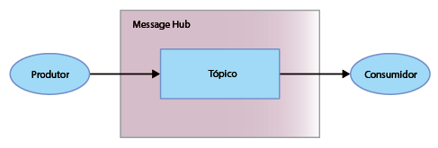

---

copyright:
  years: 2015, 2018
lastupdated: "2018-07-13"

---

{:new_window: target="_blank"}
{:shortdesc: .shortdesc}
{:screen: .screen}
{:codeblock: .codeblock}
{:pre: .pre}

# Introdução ao Message Hub 
{: #messagehub}

Para começar a usar o {{site.data.keyword.messagehub}} e iniciar o envio e recebimento
de mensagens, é possível usar a amostra Java™. A amostra exibe como um produtor envia mensagens para um consumidor usando um tópico. O
mesmo programa de amostra é usado para consumir e produzir mensagens.

Para entender mais sobre como o {{site.data.keyword.messagehub}} funciona, consulte
[Sobre o {{site.data.keyword.messagehub}}](/docs/services/MessageHub/messagehub010.html).

Para acessar outras amostras do {{site.data.keyword.messagehub}}, incluindo amostras para
Node.js e Python, consulte
[Amostras
do {{site.data.keyword.messagehub}}](https://github.com/ibm-messaging/message-hub-samples){:new_window}.

<!-- 11/01/18 - Karen - removing diagram as requested by James

-->

Execute as seguintes etapas:
{: #getting_started_steps}
 
1. Crie uma instância de serviço do {{site.data.keyword.messagehub}}:

  a. Efetue login no {{site.data.keyword.Bluemix_notm}} usando a interface com o usuário da web. 
  
  b. Clique em **CATÁLOGO**.
  
  c. Na seção **Application Services**, selecione **Plano Standard do {{site.data.keyword.messagehub}}**. A página da instância de serviço
do {{site.data.keyword.messagehub}} é aberta.
  
  d. Deixe o serviço desvinculado no menu **Conectar** e insira nomes
para seu serviço e suas credenciais. É possível usar os valores padrão.
  
  e. Clique em **Criar**.

2. Se você ainda não os tiver, instale os seguintes pré-requisitos:

    * [git
](https://git-scm.com/){:new_window}
	* [Gradle ](https://gradle.org/){:new_window}

    * Java 8 ou mais recente
 
3. Clone o repositório Git message-hub-samples executando o comando a seguir na linha de
comandos:

    <pre class="pre">
    git clone https://github.com/ibm-messaging/message-hub-samples.git
    </pre>
	{: codeblock}

4. Mude o diretório para a amostra do console java executando o comando a seguir:

    <pre class="pre">
    cd message-hub-samples/kafka-java-console-sample
    </pre>
	{: codeblock}

5. Execute os seguintes comandos de construção:

    <pre class="pre">
    gradle clean && gradle build
    </pre>
	{: codeblock}

6. Inicie o consumidor em seu console executando o comando a seguir:

    <pre class="pre">java -jar build/libs/kafka-java-console-sample-2.0.jar 
	<var class="keyword varname"> kafka_brokers_sasl </var>  <var class="keyword varname"> kafka_admin_url </var>  token <var class="keyword varname"> :api_key </var>  -consumer</pre>
    {: codeblock}
    
    A amostra usa um tópico denominado `kafka-java-console-sample-topic`. Se o tópico
ainda não existir, a amostra o criará usando a API de administração do {{site.data.keyword.messagehub}}. Para enviar e receber mensagens, a amostra usa a API do Apache Kafka Java.

    Para localizar os valores para *kafka_brokers_sasl*, *kafka_admin_url*
e *api_key*, acesse a instância do {{site.data.keyword.messagehub}} no
{{site.data.keyword.Bluemix_notm}}, acesse a guia **Credenciais de serviço** e
selecione as **Credenciais** que você deseja usar.
	
	Especifique <code>token</code> como o nome de usuário e <var class="keyword varname">api_key</var> como a sua senha. Separe
<code>token</code> e <var class="keyword varname">api_key</var> com dois-pontos.
    
	**Importante:** *kafka_brokers_sasl* deve ser uma sequência única, que
deve ser colocada entre aspas. Por exemplo:

    <pre class="pre">
    "host1:port1,host2:port2"
    </pre>
	{: codeblock}

    Recomendamos usar todos os hosts do Kafka listados nas **Credenciais** que você
selecionou.

7. Inicie o produtor em seu console executando o comando a seguir:
   
    <pre class="pre">java -jar build/libs/kafka-java-console-sample-2.0.jar 
	<var class="keyword varname"> kafka_brokers_sasl </var>  <var class="keyword varname"> kafka_admin_url </var>  token <var class="keyword varname"> :api_key </var>  -producer</pre>
 {: codeblock}
  
8. Agora as mensagens enviadas pelo produtor deverão aparecer no consumidor. A seguir está uma saída de
amostra:

    ```
    [2018-07-02 14:54:50,788] INFO Running in local mode. (com.messagehub.samples.MessageHubConsoleSample)
    [2018-07-02 14:54:50,789] INFO Kafka Endpoints: kafka-0.mh-zarjkgtnzzspbkfrkqgdhmq.us-south.containers.appdomain.cloud:9093,kafka-1.mh-zarjkgtnzzspbkfrkqgdhmq.us-south.containers.appdomain.cloud:9093,kafka-2.mh-zarjkgtnzzspbkfrkqgdhmq.us-south.containers.appdomain.cloud:9093 (com.messagehub.samples.MessageHubConsoleSample)
    [2018-07-02 14:54:50,789] INFO Admin REST Endpoint: https://mh-zarjkgtnzzspbkfrkqgdhmq.us-south.containers.appdomain.cloud (com.messagehub.samples.MessageHubConsoleSample)
    [2018-07-02 14:54:50,789] INFO Creating the topic kafka-java-console-sample-topic (com.messagehub.samples.MessageHubConsoleSample)
    [2018-07-02 14:54:52,680] INFO Admin REST response : (com.messagehub.samples.MessageHubConsoleSample)
    [2018-07-02 14:54:53,351] INFO Admin REST Listing Topics: [{"name":"kafka-java-console-sample-topic","partitions":1,"retentionMs":86400000,"cleanupPolicy":"delete"},{"name":"__consumer_offsets","partitions":50,"retentionMs":86400000,"cleanupPolicy":"compact"}] (com.messagehub.samples.MessageHubConsoleSample)
    [2018-07-02 14:54:55,126] INFO [Partition(topic = kafka-java-console-sample-topic, partition = 0, leader = 0, replicas = [0,2,1], isr = [0,2,1], offlineReplicas = [])] (com.messagehub.samples.ConsumerRunnable)
    [2018-07-02 14:54:55,126] INFO class com.messagehub.samples.ConsumerRunnable is starting. (com.messagehub.samples.ConsumerRunnable)
    [2018-07-02 14:54:56,328] INFO [Partition(topic = kafka-java-console-sample-topic, partition = 0, leader = 0, replicas = [0,2,1], isr = [0,2,1], offlineReplicas = [])] (com.messagehub.samples.ProducerRunnable)
    [2018-07-02 14:54:56,328] INFO MessageHubConsoleSample will run until interrupted. (com.messagehub.samples.MessageHubConsoleSample)
    [2018-07-02 14:54:56,328] INFO class com.messagehub.samples.ProducerRunnable is starting. (com.messagehub.samples.ProducerRunnable)
    [2018-07-02 14:54:57,514] INFO Message produced, offset: 0 (com.messagehub.samples.ProducerRunnable)
    [2018-07-02 14:54:59,652] INFO Message produced, offset: 1 (com.messagehub.samples.ProducerRunnable)
    [2018-07-02 14:55:00,671] INFO No messages consumed (com.messagehub.samples.ConsumerRunnable)
    [2018-07-02 14:55:01,788] INFO Message produced, offset: 2 (com.messagehub.samples.ProducerRunnable)
    [2018-07-02 14:55:01,797] INFO Message consumed: ConsumerRecord(topic = kafka-java-console-sample-topic, partition = 0, offset = 2, CreateTime = 1530539701655, serialized key size = 3, serialized value size = 25, headers = RecordHeaders(headers = [], isReadOnly = false), key = key, value = This is a test message #2) (com.messagehub.samples.ConsumerRunnable)
    [2018-07-02 14:55:03,921] INFO Message consumed: ConsumerRecord(topic = kafka-java-console-sample-topic, partition = 0, offset = 3, CreateTime = 1530539703789, serialized key size = 3, serialized value size = 25, headers = RecordHeaders(headers = [], isReadOnly = false), key = key, value = This is a test message #3) (com.messagehub.samples.ConsumerRunnable)
    [2018-07-02 14:55:03,921] INFO Message produced, offset: 3 (com.messagehub.samples.ProducerRunnable)
    [2018-07-02 14:55:06,053] INFO Message consumed: ConsumerRecord(topic = kafka-java-console-sample-topic, partition = 0, offset = 4, CreateTime = 1530539705922, serialized key size = 3, serialized value size = 25, headers = RecordHeaders(headers = [], isReadOnly = false), key = key, value = This is a test message #4) (com.messagehub.samples.ConsumerRunnable)
    [2018-07-02 14:55:06,054] INFO Message produced, offset: 4 (com.messagehub.samples.ProducerRunnable)
    [2018-07-02 14:55:08,186] INFO Message consumed: ConsumerRecord(topic = kafka-java-console-sample-topic, partition = 0, offset = 5, CreateTime = 1530539708055, serialized key size = 3, serialized value size = 25, headers = RecordHeaders(headers = [], isReadOnly = false), key = key, value = This is a test message #5) (com.messagehub.samples.ConsumerRunnable)
    ```
	{: codeblock}
	
9. A amostra é executada indefinidamente até que ela seja interrompida. Para parar o processo, execute
um comando como segue: <code>Ctrl+C</code>

<!-- 07/06/18 - Karen: removing until a newer version available
To watch a video that walks
you through getting a Java sample to run against {{site.data.keyword.messagehub}}, see [{{site.data.keyword.messagehub}} - Getting started with IBM's Kafka in the cloud ](https://www.youtube.com/watch?v=tt-bLtFzC_4){:new_window}.
-->


