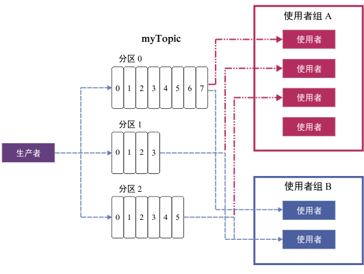

---

copyright:
  years: 2015, 2018
lastupdated: "2018-06-29"

---

{:new_window: target="_blank"}
{:shortdesc: .shortdesc}
{:screen: .screen}
{:codeblock: .codeblock}
{:pre: .pre}

# Apache Kafka 概念
{: #apache_kafka}

下面的列表定义了 Apache Kafka 的部分概念：

<dl>
<dt>服务器</dt>
<dd>Kafka 安装由一个或多个单独的服务器组成。这些服务器可以位于地理位置不同的数据中心内。
</dd>
 
<dt>集群</dt>
<dd>Kafka 作为一个或多个服务器的集群运行。通过在服务器之间分配负载，可在整个集群中对负载进行均衡。</dd>
 
<dt>消息</dt>
<dd>Kafka 中的数据单位。每条消息表示为一条记录，由两部分组成：键和值。键通常用于表示消息相关数据，值是消息的主体。Kafka 使用的“记录”和“消息”两个术语可以互换。 

其他许多消息传递系统也可以随消息一起传递其他信息。针对此用途，Kafka 0.11 引入了记录头，{{site.data.keyword.messagehub}} 企业套餐支持记录头。
{{site.data.keyword.messagehub}} 标准套餐目前基于 Kafka 0.10.2.1，因此它尚不支持记录头。
 

由于 Kafka 生态系统中的许多工具（例如，连接其他系统的连接器）只使用值而忽略键，因此最好将所有消息数据都放入值中，并仅在分区或记录压缩时使用键。不应该为了使用键而依赖从 Kafka 读取的所有内容。
   </dd>
<dt>主题</dt>
<dd>命名的消息流。</dd>
 
<dt>分区</dt>
<dd>每个主题包含一个或多个分区。每个分区都是一个有序的消息列表。分区上的每条消息都会被赋予一个单调递增数字，此数字称为偏移量。
每个分区在集群中都有一台服务器充当分区的领导者，其他服务器充当追随者。

如果某个主题的分区不止一个，那么可以将这些分区分布到整个集群中，这样就能并行馈送数据，从而提高吞吐量。分区的数量也会影响工作负载在使用者之间的均衡。

有关更多信息，请参阅[分区领导权](/docs/services/EventStreams/eventstreams118.html)。</dd>
<dt>生产者</dt>
<dd>向 Kafka 主题发布消息流的过程。生产者可以发布一个或更多主题，并且可以选择用于存储数据的分区。 </dd>
 
<dt>使用者</dt>
<dd>使用 Kafka 主题中的消息以及对消息订阅源进行处理的过程。使用者可以使用一个或多个主题或分区。</dd>
 
<dt>使用者组</dt>
<dd>由一个或多个使用者构成的命名组，这些使用者可以一起使用一系列主题中的消息。组中每个使用者会读取为其分配的特定分区的消息。每个分区只分配给组中一个使用者。<ul>
<li>如果分区数量多于组中使用者数量，那么部分使用者拥有多个分区。</li>
<li>如果使用者数量多于分区数量，那么部分使用者没有分区。</li>
</ul>
</dd>
</dl>

要了解更多信息，请参阅以下信息：
- [生成消息](/docs/services/EventStreams/eventstreams112.html)
- [使用消息](/docs/services/EventStreams/eventstreams114.html) 
- [分区领导权](/docs/services/EventStreams/eventstreams118.html) 
- [Apache Kafka 文档 ](http://kafka.apache.org/documentation.html){:new_window} 

<!-- 27/06/18 Karen: removing - suggestion from James

## {{site.data.keyword.messagehub}} plans
{{site.data.keyword.messagehub}} is available as two different plans depending on your requirements: Standard and Enterprise.

* Choose the Standard plan if you want event ingest and distribution capabilities, where you pay for what you use and share infrastructure with others.
* Choose the Enterprise plan if data isolation, guaranteed performance, and increased retention are important considerations. 

For more information, see [Choosing your plan](/docs/services/EventStreams/eventstreams085.html).
-->

