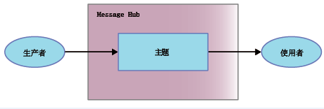

---

copyright:
  years: 2015, 2018
lastupdated: "2018-07-13"

---

{:new_window: target="_blank"}
{:shortdesc: .shortdesc}
{:screen: .screen}
{:codeblock: .codeblock}
{:pre: .pre}

# Message Hub 入门 
{: #messagehub}

要开始使用 {{site.data.keyword.messagehub}} 并开始发送和接收消息，可以使用 Java™ 样本。样本显示生产者如何使用主题将消息发送给使用者。同一个样本程序用于使用消息和生成消息。

要了解有关 {{site.data.keyword.messagehub}} 如何运行的更多信息，请参阅[关于 {{site.data.keyword.messagehub}}](/docs/services/MessageHub/messagehub010.html)。

要访问其他 {{site.data.keyword.messagehub}} 样本，包括 Node.js 和 Python 的样本，请参阅 [{{site.data.keyword.messagehub}} 样本 ](https://github.com/ibm-messaging/message-hub-samples){:new_window}。

<!-- 11/01/18 - Karen - removing diagram as requested by James

-->

请完成以下步骤：
{: #getting_started_steps}
 
1. 创建 {{site.data.keyword.messagehub}} 服务实例：

  a. 使用 Web 用户界面登录到 {{site.data.keyword.Bluemix_notm}}。 
  
  b. 单击**目录**。
  
  c. 在**应用程序服务**部分中，选择 **{{site.data.keyword.messagehub}} 标准套餐**。这将打开 {{site.data.keyword.messagehub}} 服务实例页面。
  
  d. 在**连接至**菜单中，使该服务保持未绑定状态，并输入服务和凭证的名称。可以使用缺省值。
  
  e. 单击**创建**。

2. 如果还没有以下必备软件，请进行安装：

    * [git ](https://git-scm.com/){:new_window}
	* [Gradle ](https://gradle.org/){:new_window}
    * Java 8 或更高版本
 
3. 通过在命令行中运行以下命令，克隆 message-hub-samples Git 存储库：

    <pre class="pre">
    git clone https://github.com/ibm-messaging/message-hub-samples.git
    </pre>
	{: codeblock}

4. 通过运行以下命令，将目录切换到 Java 控制台样本：

    <pre class="pre">
    cd message-hub-samples/kafka-java-console-sample
    </pre>
	{: codeblock}

5. 运行以下构建命令：

    <pre class="pre">
    gradle clean && gradle build
    </pre>
	{: codeblock}

6. 通过运行以下命令，在控制台上启动使用者：

    <pre class="pre">java -jar build/libs/kafka-java-console-sample-2.0.jar 
	<var class="keyword varname">kafka_brokers_sasl</var> <var class="keyword varname">kafka_admin_url</var> token<var class="keyword varname">:api_key</var> -consumer</pre>
    {: codeblock}
    
    样本使用名为 `kafka-java-console-sample-topic` 的主题。如果该主题尚不存在，样本会使用 {{site.data.keyword.messagehub}} 管理 API 进行创建。为了发送和接收消息，该样本会使用 Apache Kafka Java API。

    要找到 *kafka_brokers_sasl*、*kafka_admin_url* 和 *api_key* 的值，请转至 {{site.data.keyword.Bluemix_notm}} 中的 {{site.data.keyword.messagehub}} 实例，转至**服务凭证**选项卡，然后选择要使用的**凭证**。
	
	指定 <code>token</code> 作为用户名，<var class="keyword varname">api_key</var> 作为密码。使用冒号分隔 <code>token</code> 和 <var class="keyword varname">api_key</var>。
    
	**重要信息**：*kafka_brokers_sasl* 必须为单个字符串，并且必须用引号将其括起。例如：

    <pre class="pre">
    "host1:port1,host2:port2"
    </pre>
	{: codeblock}

    建议使用所选**凭证**中列出的所有 Kafka 主机。

7. 通过运行以下命令，在控制台上启动生产者：
   
    <pre class="pre">java -jar build/libs/kafka-java-console-sample-2.0.jar 
	<var class="keyword varname">kafka_brokers_sasl</var> <var class="keyword varname">kafka_admin_url</var> token<var class="keyword varname">:api_key</var> -producer</pre>
 {: codeblock}
  
8. 现在，应该会看到生产者发送的消息显示在使用者中。下面是部分样本输出：

    ```
    [2018-07-02 14:54:50,788] INFO Running in local mode. (com.messagehub.samples.MessageHubConsoleSample)
    [2018-07-02 14:54:50,789] INFO Kafka Endpoints: kafka-0.mh-zarjkgtnzzspbkfrkqgdhmq.us-south.containers.appdomain.cloud:9093,kafka-1.mh-zarjkgtnzzspbkfrkqgdhmq.us-south.containers.appdomain.cloud:9093,kafka-2.mh-zarjkgtnzzspbkfrkqgdhmq.us-south.containers.appdomain.cloud:9093 (com.messagehub.samples.MessageHubConsoleSample)
    [2018-07-02 14:54:50,789] INFO Admin REST Endpoint: https://mh-zarjkgtnzzspbkfrkqgdhmq.us-south.containers.appdomain.cloud (com.messagehub.samples.MessageHubConsoleSample)
    [2018-07-02 14:54:50,789] INFO Creating the topic kafka-java-console-sample-topic (com.messagehub.samples.MessageHubConsoleSample)
    [2018-07-02 14:54:52,680] INFO Admin REST response : (com.messagehub.samples.MessageHubConsoleSample)
    [2018-07-02 14:54:53,351] INFO Admin REST Listing Topics: [{"name":"kafka-java-console-sample-topic","partitions":1,"retentionMs":86400000,"cleanupPolicy":"delete"},{"name":"__consumer_offsets","partitions":50,"retentionMs":86400000,"cleanupPolicy":"compact"}] (com.messagehub.samples.MessageHubConsoleSample)
    [2018-07-02 14:54:55,126] INFO [Partition(topic = kafka-java-console-sample-topic, partition = 0, leader = 0, replicas = [0,2,1], isr = [0,2,1], offlineReplicas = [])] (com.messagehub.samples.ConsumerRunnable)
    [2018-07-02 14:54:55,126] INFO class com.messagehub.samples.ConsumerRunnable is starting. (com.messagehub.samples.ConsumerRunnable)
    [2018-07-02 14:54:56,328] INFO [Partition(topic = kafka-java-console-sample-topic, partition = 0, leader = 0, replicas = [0,2,1], isr = [0,2,1], offlineReplicas = [])] (com.messagehub.samples.ProducerRunnable)
    [2018-07-02 14:54:56,328] INFO MessageHubConsoleSample will run until interrupted. (com.messagehub.samples.MessageHubConsoleSample)
    [2018-07-02 14:54:56,328] INFO class com.messagehub.samples.ProducerRunnable is starting. (com.messagehub.samples.ProducerRunnable)
    [2018-07-02 14:54:57,514] INFO Message produced, offset: 0 (com.messagehub.samples.ProducerRunnable)
    [2018-07-02 14:54:59,652] INFO Message produced, offset: 1 (com.messagehub.samples.ProducerRunnable)
    [2018-07-02 14:55:00,671] INFO No messages consumed (com.messagehub.samples.ConsumerRunnable)
    [2018-07-02 14:55:01,788] INFO Message produced, offset: 2 (com.messagehub.samples.ProducerRunnable)
    [2018-07-02 14:55:01,797] INFO Message consumed: ConsumerRecord(topic = kafka-java-console-sample-topic, partition = 0, offset = 2, CreateTime = 1530539701655, serialized key size = 3, serialized value size = 25, headers = RecordHeaders(headers = [], isReadOnly = false), key = key, value = This is a test message #2) (com.messagehub.samples.ConsumerRunnable)
    [2018-07-02 14:55:03,921] INFO Message consumed: ConsumerRecord(topic = kafka-java-console-sample-topic, partition = 0, offset = 3, CreateTime = 1530539703789, serialized key size = 3, serialized value size = 25, headers = RecordHeaders(headers = [], isReadOnly = false), key = key, value = This is a test message #3) (com.messagehub.samples.ConsumerRunnable)
    [2018-07-02 14:55:03,921] INFO Message produced, offset: 3 (com.messagehub.samples.ProducerRunnable)
    [2018-07-02 14:55:06,053] INFO Message consumed: ConsumerRecord(topic = kafka-java-console-sample-topic, partition = 0, offset = 4, CreateTime = 1530539705922, serialized key size = 3, serialized value size = 25, headers = RecordHeaders(headers = [], isReadOnly = false), key = key, value = This is a test message #4) (com.messagehub.samples.ConsumerRunnable)
    [2018-07-02 14:55:06,054] INFO Message produced, offset: 4 (com.messagehub.samples.ProducerRunnable)
    [2018-07-02 14:55:08,186] INFO Message consumed: ConsumerRecord(topic = kafka-java-console-sample-topic, partition = 0, offset = 5, CreateTime = 1530539708055, serialized key size = 3, serialized value size = 25, headers = RecordHeaders(headers = [], isReadOnly = false), key = key, value = This is a test message #5) (com.messagehub.samples.ConsumerRunnable)
    ```
	{: codeblock}
	
9. 样本会无限期运行，直到您将其停止。要停止该进程，请运行类似下面的命令：<code>Ctrl+C</code>

<!-- 07/06/18 - Karen: removing until a newer version available
To watch a video that walks
you through getting a Java sample to run against {{site.data.keyword.messagehub}}, see [{{site.data.keyword.messagehub}} - Getting started with IBM's Kafka in the cloud ](https://www.youtube.com/watch?v=tt-bLtFzC_4){:new_window}.
-->


