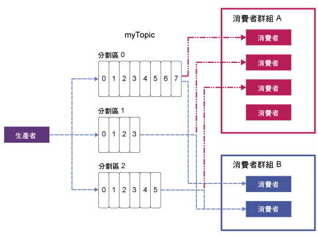

---

copyright:
  years: 2015, 2019
lastupdated: "2018-06-29"

---

{:new_window: target="_blank"}
{:shortdesc: .shortdesc}
{:screen: .screen}
{:codeblock: .codeblock}
{:pre: .pre}

# Apache Kafka 概念
{: #apache_kafka}

{: shortdesc}

下列清單定義部分 Apache Kafka 概念：

<dl>
<dt>伺服器</dt>
<dd>Kafka 安裝包含了一部以上的個別伺服器機器。這些伺服器可以位於地理上完全不同的資料中心。</dd>
 
<dt>叢集</dt>
<dd>Kafka 會作為一部以上伺服器的叢集執行。藉由在伺服器之間配送負載來平衡整個叢集的負載。</dd>
 
<dt>訊息</dt>
<dd>Kafka 的資料單位。每一則訊息都表示為一筆記錄，其包含兩個部分：索引鍵及值。索引鍵通常用於有關訊息的資料，值則是訊息內文。Kafka 交換使用術語記錄及訊息。 

許多其他傳訊系統也有一種攜帶其他資訊與訊息的方式。Kafka 0.11 基於此目的引進了記錄標頭，這受到 {{site.data.keyword.messagehub}} 企業方案的支援。{{site.data.keyword.messagehub}} 標準方案目前以 Kafka 0.10.2.1 為基礎，因此還不支援記錄標頭。
 

因為 Kafka 生態系統中的許多工具（例如連接至其他系統的連接器）都只使用值而忽略索引鍵，所以最好是將所有訊息資料都放入值中，並只使用索引鍵進行分割或日誌壓縮。您不應該根據從 Kafka 讀取的任何內容來使用索引鍵。
   </dd>
<dt>主題</dt>
<dd>包含訊息的具名串流。</dd>
 
<dt>分割區</dt>
<dd>每個主題包含一個以上的分割區。每一個分割區都是訊息的排序清單。分割區上的每一則訊息都被指定一個單調的遞增數字，稱為偏移。
每一個分割區在叢集中都有一部伺服器用來作為分割區的領導者，而其他伺服器則作為追隨者。

如果某個主題具有多個分割區，它容許藉由在整個叢集中配送分割區來同時提供資料以增加傳輸量。分割區數目也會影響消費者的工作負載平衡。

如需相關資訊，請參閱[分割區領導權](/docs/services/EventStreams/eventstreams118.html)。</dd>
<dt>生產者</dt>
<dd>將訊息串流發佈至 Kafka 主題的處理程序。生產者可以發佈至一個以上的主題，也可以選擇性地選擇用來儲存資料的分割區。 </dd>
 
<dt>消費者</dt>
<dd>從 Kafka 主題取用訊息，以及處理訊息提供的處理程序。消費者可以取用一個以上的主題或分割區。</dd>
 
<dt>消費者群組</dt>
<dd>包含一個以上消費者的具名群組，一起取用來自一組主題的訊息。群組中的每一個消費者都會從指派給該消費者的特定分割區中讀取訊息。每一個分割區只能指派給群組中的一個消費者。<ul>
<li>如果分割區多於群組中的消費者，則某些消費者具有多個分割區。</li>
<li>如果消費者多於分割區，則某些消費者沒有任何分割區。</li>
</ul>
</dd>
</dl>

若要進一步瞭解，請參閱下列資訊：
- [產生訊息](/docs/services/EventStreams/eventstreams112.html)
- [取用訊息](/docs/services/EventStreams/eventstreams114.html) 
- [分割區領導權](/docs/services/EventStreams/eventstreams118.html) 
- [Apache Kafka 文件 ](http://kafka.apache.org/documentation.html){:new_window} 

<!-- 27/06/18 Karen: removing - suggestion from James

## {{site.data.keyword.messagehub}} plans
{{site.data.keyword.messagehub}} is available as two different plans depending on your requirements: Standard and Enterprise.

* Choose the Standard plan if you want event ingest and distribution capabilities, where you pay for what you use and share infrastructure with others.
* Choose the Enterprise plan if data isolation, guaranteed performance, and increased retention are important considerations. 

For more information, see [Choosing your plan](/docs/services/EventStreams/eventstreams085.html).
-->

