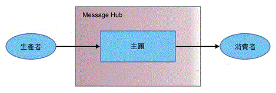

---

copyright:
  years: 2015, 2018
lastupdated: "2018-11-15"

---

{:new_window: target="_blank"}
{:shortdesc: .shortdesc}
{:screen: .screen}
{:codeblock: .codeblock}
{:pre: .pre}

# 開始使用 {{site.data.keyword.messagehub}} 
{: #getting_started}

若要開始使用 {{site.data.keyword.messagehub}} 和開始傳送及接收訊息，您可以使用 Java™ 範例。範例顯示生產者如何使用主題將訊息傳送到消費者。相同的範例程式用來使用訊息，以及產生訊息。

若要進一步瞭解 {{site.data.keyword.messagehub}} 的運作方式，請參閱[關於 {{site.data.keyword.messagehub}}](/docs/services/EventStreams/eventstreams010.html)。{{site.data.keyword.messagehub}} 先前稱為 Message Hub。

若要存取其他 {{site.data.keyword.messagehub}} 範例（包括 Node.js 及 Python 範例），請參閱 [{{site.data.keyword.messagehub}} 範例 ](https://github.com/ibm-messaging/event-streams-samples){:new_window}。

<!-- 11/01/18 - Karen - removing diagram as requested by James

-->

請完成下列步驟：
{: #getting_started_steps}
 
1. 建立 {{site.data.keyword.messagehub}} 服務實例：

  a. 登入 {{site.data.keyword.Bluemix_notm}} 主控台。 
  
  b. 按一下**型錄**。
  
  c. 在**整合**區段中，選取 **{{site.data.keyword.messagehub}} 標準方案**。即會開啟 {{site.data.keyword.messagehub}} 服務實例頁面。
  
  d. 輸入服務的名稱。您可以使用預設值。
  
  e. 按一下**建立**。

2. {: #create_credentials_step notoc} 完成下列步驟，以建立部分 {{site.data.keyword.messagehub}} 認證：[使用 IBM Cloud 主控台取得認證並連接](/docs/services/EventStreams/eventstreams127.html#connect_standard_cf_console)。
   <br/>
   <br/>針對此作業的[步驟 7](/docs/services/EventStreams/index.html#start_consumer_step)，您將需要 *kafka_brokers_sasl*、*kafka_admin_url* 及 *api_key* 值。   

3. 如果您還沒有下列必要條件，請安裝它們：

    * [git ](https://git-scm.com/){:new_window}
	* [Gradle ](https://gradle.org/){:new_window}
    * Java 8 或更高版本
 
4. 從指令行執行下列指令，以複製 event-streams-samples Git 儲存庫：

    <pre class="pre">
    git clone https://github.com/ibm-messaging/event-streams-samples.git
    </pre>
	{: codeblock}

5. 執行下列指令切換至 Java 主控台範例目錄：

    <pre class="pre">
    cd event-streams-samples/kafka-java-console-sample
    </pre>
	{: codeblock}

6. 執行下列建置指令：

    <pre class="pre">
    gradle clean && gradle build
    </pre>
	{: codeblock}

7. {: #start_consumer_step notoc}執行下列指令，在主控台上啟動消費者：

    <pre class="pre">java -jar build/libs/kafka-java-console-sample-2.0-all.jar
	<var class="keyword varname">kafka_brokers_sasl</var> <var class="keyword varname">kafka_admin_url</var> token<var class="keyword varname">:api_key</var> -consumer</pre>
    {: codeblock}
    
    此範例使用名為 `kafka-java-console-sample-topic` 的主題。如果主題尚不存在，範例會使用 {{site.data.keyword.messagehub}} 管理 API 建立它。為了傳送及接收訊息，範例會使用 Apache Kafka Java API。

    使用[步驟 2](/docs/services/EventStreams/index.html#create_credentials_step) 中所建立認證的 *kafka_brokers_sasl*、*kafka_admin_url* 及 *api_key* 值。
	
	指定 <code>token</code> 作為您的使用者名稱、<var class="keyword varname">api_key</var> 作為您的密碼。請以冒號區隔 <code>token</code> 及 <var class="keyword varname">api_key</var>。
    
	**重要事項**：*kafka_brokers_sasl* 必須是單一字串，並且您必須以單引號括住它。例如：

    <pre class="pre">
    "host1:port1,host2:port2"
    </pre>
	{: codeblock}

    我們建議您使用所選取**認證**中列出的所有 Kafka 主機。

8. 執行下列指令，在主控台上啟動生產者：
   
    <pre class="pre">java -jar build/libs/kafka-java-console-sample-2.0-all.jar
	<var class="keyword varname">kafka_brokers_sasl</var> <var class="keyword varname">kafka_admin_url</var> token<var class="keyword varname">:api_key</var> -producer</pre>
 {: codeblock}
  
9. 您現在應該會看到生產者傳送的訊息出現在消費者。以下是部分範例輸出：

    ```
[2018-07-02 14:54:50,788] INFO Running in local mode. (com.messagehub.samples.MessageHubConsoleSample)
    [2018-07-02 14:54:50,789] INFO Kafka Endpoints: kafka-0.mh-zarjkgtnzzspbkfrkqgdhmq.us-south.containers.appdomain.cloud:9093,kafka-1.mh-zarjkgtnzzspbkfrkqgdhmq.us-south.containers.appdomain.cloud:9093,kafka-2.mh-zarjkgtnzzspbkfrkqgdhmq.us-south.containers.appdomain.cloud:9093 (com.messagehub.samples.MessageHubConsoleSample)
    [2018-07-02 14:54:50,789] INFO Admin REST Endpoint: https://mh-zarjkgtnzzspbkfrkqgdhmq.us-south.containers.appdomain.cloud (com.messagehub.samples.MessageHubConsoleSample)
    [2018-07-02 14:54:50,789] INFO Creating the topic kafka-java-console-sample-topic (com.messagehub.samples.MessageHubConsoleSample)
    [2018-07-02 14:54:52,680] INFO Admin REST response : (com.messagehub.samples.MessageHubConsoleSample)
    [2018-07-02 14:54:53,351] INFO Admin REST Listing Topics: [{"name":"kafka-java-console-sample-topic","partitions":1,"retentionMs":86400000,"cleanupPolicy":"delete"},{"name":"__consumer_offsets","partitions":50,"retentionMs":86400000,"cleanupPolicy":"compact"}] (com.messagehub.samples.MessageHubConsoleSample)
    [2018-07-02 14:54:55,126] INFO [Partition(topic = kafka-java-console-sample-topic, partition = 0, leader = 0, replicas = [0,2,1], isr = [0,2,1], offlineReplicas = [])] (com.messagehub.samples.ConsumerRunnable)
    [2018-07-02 14:54:55,126] INFO class com.messagehub.samples.ConsumerRunnable is starting. (com.messagehub.samples.ConsumerRunnable)
    [2018-07-02 14:54:56,328] INFO [Partition(topic = kafka-java-console-sample-topic, partition = 0, leader = 0, replicas = [0,2,1], isr = [0,2,1], offlineReplicas = [])] (com.messagehub.samples.ProducerRunnable)
    [2018-07-02 14:54:56,328] INFO MessageHubConsoleSample will run until interrupted. (com.messagehub.samples.MessageHubConsoleSample)
    [2018-07-02 14:54:56,328] INFO class com.messagehub.samples.ProducerRunnable is starting. (com.messagehub.samples.ProducerRunnable)
    [2018-07-02 14:54:57,514] INFO Message produced, offset: 0 (com.messagehub.samples.ProducerRunnable)
    [2018-07-02 14:54:59,652] INFO Message produced, offset: 1 (com.messagehub.samples.ProducerRunnable)
    [2018-07-02 14:55:00,671] INFO No messages consumed (com.messagehub.samples.ConsumerRunnable)
    [2018-07-02 14:55:01,788] INFO Message produced, offset: 2 (com.messagehub.samples.ProducerRunnable)
    [2018-07-02 14:55:01,797] INFO Message consumed: ConsumerRecord(topic = kafka-java-console-sample-topic, partition = 0, offset = 2, CreateTime = 1530539701655, serialized key size = 3, serialized value size = 25, headers = RecordHeaders(headers = [], isReadOnly = false), key = key, value = This is a test message #2) (com.messagehub.samples.ConsumerRunnable)
    [2018-07-02 14:55:03,921] INFO Message consumed: ConsumerRecord(topic = kafka-java-console-sample-topic, partition = 0, offset = 3, CreateTime = 1530539703789, serialized key size = 3, serialized value size = 25, headers = RecordHeaders(headers = [], isReadOnly = false), key = key, value = This is a test message #3) (com.messagehub.samples.ConsumerRunnable)
    [2018-07-02 14:55:03,921] INFO Message produced, offset: 3 (com.messagehub.samples.ProducerRunnable)
    [2018-07-02 14:55:06,053] INFO Message consumed: ConsumerRecord(topic = kafka-java-console-sample-topic, partition = 0, offset = 4, CreateTime = 1530539705922, serialized key size = 3, serialized value size = 25, headers = RecordHeaders(headers = [], isReadOnly = false), key = key, value = This is a test message #4) (com.messagehub.samples.ConsumerRunnable)
    [2018-07-02 14:55:06,054] INFO Message produced, offset: 4 (com.messagehub.samples.ProducerRunnable)
    [2018-07-02 14:55:08,186] INFO Message consumed: ConsumerRecord(topic = kafka-java-console-sample-topic, partition = 0, offset = 5, CreateTime = 1530539708055, serialized key size = 3, serialized value size = 25, headers = RecordHeaders(headers = [], isReadOnly = false), key = key, value = This is a test message #5) (com.messagehub.samples.ConsumerRunnable)
    ```
	{: codeblock}
	
10. 範例會無限制地執行，直到您停止它為止。若要停止處理程序，請執行如下的指令：<code>Ctrl+C</code>

<!-- 07/06/18 - Karen: removing until a newer version available
To watch a video that walks
you through getting a Java sample to run against {{site.data.keyword.messagehub}}, see [{{site.data.keyword.messagehub}} - Getting started with IBM's Kafka in the cloud ](https://www.youtube.com/watch?v=tt-bLtFzC_4){:new_window}.
-->


